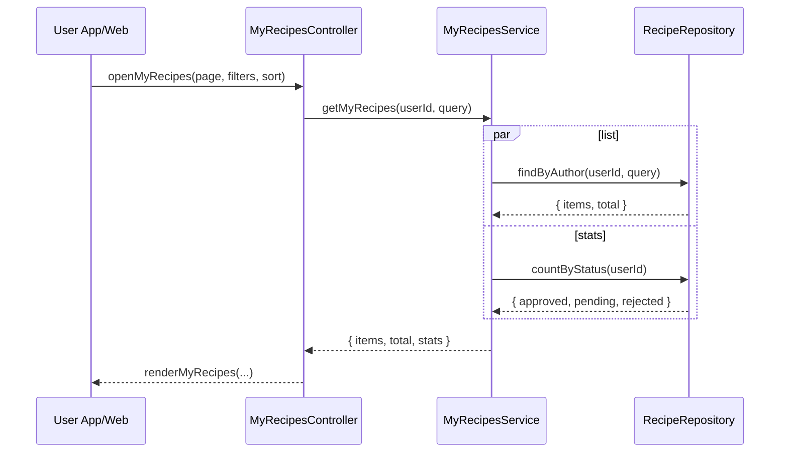

# Template Đặc Tả SEQUENCE DIAGRAM (SD)

## I. Thông Tin Tổng Quan (Header Information)

| Trường (Field) | Nội dung | Ghi chú/Ví dụ |
| :--- | :--- | :--- |
| **SD ID** | SD-UCS03-2 | Tương ứng UCS03-2 |
| **Related UC ID** | UCS03-2 | Xem danh sách công thức đã tạo |
| **SD Name** | Luồng xem danh sách công thức cá nhân |
| **Description** | Người dùng mở "Công thức của tôi"; hệ thống truy vấn, hiển thị thống kê, danh sách với filter/sort và phân trang. |
| **Primary Actor** | User |
| **Phiên bản (Version)** | 0.1.0 |
| **Trạng thái (Status)** | Draft |
| **Tác giả (Author)** |  |
| **Ngày (Date)** |  |
| **Liên kết UC/BR/NFR** | `UC/UC3/UCS03-2_Xem_danh_sach_cong_thuc_da_tao.md` |
| **Nguồn biểu đồ (Diagram Source)** | Mermaid |
| **Tài liệu liên quan (Related Artifacts)** | API Spec, DB `Recipe` |

---

## II. Danh Sách Đối Tượng Tham Gia (Participants / Lifelines)

| ID | Tên Đối tượng | Stereotype | Ownership | Protocol | API Ver | Mô tả |
| :--- | :--- | :--- | :--- | :--- | :--- | :--- |
| L1 | User App/Web | Boundary | Client | HTTP | n/a | UI "Công thức của tôi" |
| L2 | MyRecipesController | Control | Core | Internal | v1 | Điều phối |
| L3 | MyRecipesService | Service | Core | Internal | v1 | Truy vấn danh sách và thống kê |
| L4 | RecipeRepository | Entity/DAO | Data | SQL | n/a | Truy cập `Recipe` |

---

## III. Biểu Đồ Sequence Diagram (Visual Model)

---

## IV. Đặc Tả Chi Tiết Luồng Tương Tác (Interaction Flow Specification)

### A. Luồng Thành công Chính (Basic Success Flow)

| STT | Hành động | Message | Sync/Async | Input | Output | Source | Target | Error/Timeout | Txn |
| :--- | :--- | :--- | :--- | :--- | :--- | :--- | :--- | :--- | :--- |
| 1 | Mở danh sách | `openMyRecipes(...)` | Sync | `{ page, filters, sort }` | `200` | L1 | L2 | 401 | N/A |
| 2 | Truy vấn | `findByAuthor(...)` | Sync | `{ userId, query }` | `{ items, total }` | L3 | L4 | 5xx | Đọc |
| 3 | Thống kê | `countByStatus(...)` | Sync | `{ userId }` | `{ stats }` | L3 | L4 | 5xx | Đọc |
| 4 | Render | `renderMyRecipes(...)` | Sync | `{ items, stats }` | UI updated | L2 | L1 | - | N/A |

### B. Alternative/Exception Flows

| ID | Type | Guard | Affect | Error | Recovery | UI Message | Telemetry |
| :--- | :--- | :--- | :--- | :--- | :--- | :--- | :--- |
| EF-1 | [alt] | Chưa có công thức | Thay thế 4 | EMPTY | Gợi ý tạo mới | "Bạn chưa tạo công thức nào" | log: info |
| EF-2 | [alt] | Lỗi tải | Thay thế 4 | SERVER_ERROR | Retry | "Không thể tải danh sách" | log: error |

---

## V. Ghi Chú & Ràng Buộc

| Trường | Chi tiết |
| :--- | :--- |
| Security | Chỉ hiển thị của chính chủ |
| Performance | Tải < 2s; phân trang 20/trang |

---

## VI. Tác Động Dữ Liệu

| Bảng | Hành động | Trường |
| :--- | :--- | :--- |
| `Recipe` | READ | by authorId |

---

## VII. Giả Định & Câu Hỏi Mở

- Giả định: Có export PDF/Excel.
- Câu hỏi mở: Lọc nhiều tiêu chí đồng thời?

---

## VIII. Nguồn Biểu Đồ

- Mermaid embedded ở mục III.

