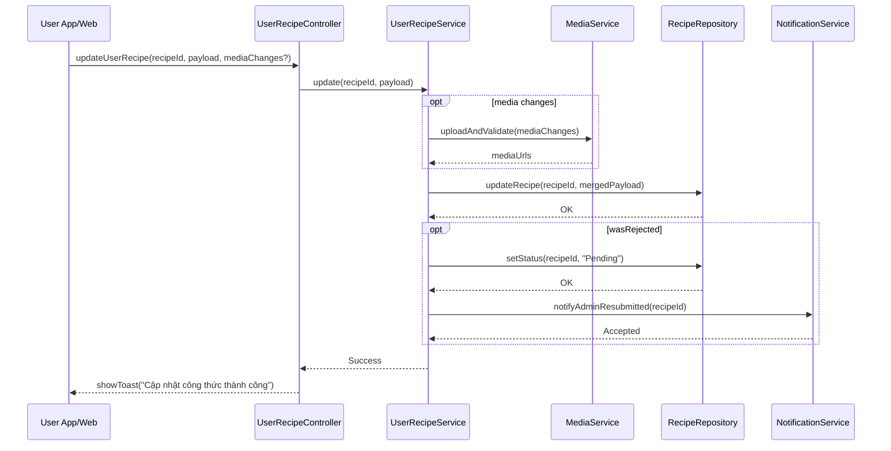

# Template Đặc Tả SEQUENCE DIAGRAM (SD)

## I. Thông Tin Tổng Quan (Header Information)

| Trường (Field) | Nội dung | Ghi chú/Ví dụ |
| :--- | :--- | :--- |
| **SD ID** | SD-UCS03-3 | Tương ứng UCS03-3 |
| **Related UC ID** | UCS03-3 | Chỉnh sửa công thức đã tạo |
| **SD Name** | Luồng chỉnh sửa công thức |
| **Description** | Người dùng chỉnh sửa công thức của mình (chỉ khi Nháp/Chờ duyệt/Bị từ chối); hệ thống validate, upload media (nếu có), cập nhật DB và cập nhật trạng thái. |
| **Primary Actor** | User |
| **Phiên bản (Version)** | 0.1.0 |
| **Trạng thái (Status)** | Draft |
| **Tác giả (Author)** |  |
| **Ngày (Date)** |  |
| **Liên kết UC/BR/NFR** | `UC/UC3/UCS03-3_Chinh_sua_cong_thuc_da_tao.md` |
| **Nguồn biểu đồ (Diagram Source)** | Mermaid |
| **Tài liệu liên quan (Related Artifacts)** | API Spec, DB `Recipe`, Media, Notification |

---

## II. Danh Sách Đối Tượng Tham Gia (Participants / Lifelines)

| ID | Tên Đối tượng | Stereotype | Ownership | Protocol | API Ver | Mô tả |
| :--- | :--- | :--- | :--- | :--- | :--- | :--- |
| L1 | User App/Web | Boundary | Client | HTTP | n/a | UI chỉnh sửa |
| L2 | UserRecipeController | Control | Core | Internal | v1 | Điều phối |
| L3 | UserRecipeService | Service | Core | Internal | v1 | Nghiệp vụ cập nhật |
| L4 | MediaService | Service | Core | Internal | v1 | Upload/validate media |
| L5 | RecipeRepository | Entity/DAO | Data | SQL | n/a | Cập nhật công thức |
| L6 | NotificationService | Service | Core | Internal | v1 | Thông báo admin khi resubmit |

---

## III. Biểu Đồ Sequence Diagram (Visual Model)

---

## IV. Đặc Tả Chi Tiết Luồng Tương Tác (Interaction Flow Specification)

### A. Luồng Thành công Chính (Basic Success Flow)

| STT | Hành động | Message | Sync/Async | Input | Output | Source | Target | Error/Timeout | Txn |
| :--- | :--- | :--- | :--- | :--- | :--- | :--- | :--- | :--- | :--- |
| 1 | Submit | `updateUserRecipe(...)` | Sync | `{ recipeId, payload, media? }` | `200` | L1 | L2 | 401 | N/A |
| 2 | Upload media | `uploadAndValidate(...)` | Sync | `{ files }` | `{ urls }` | L3 | L4 | timeout | Đang mở |
| 3 | Cập nhật DB | `updateRecipe(...)` | Sync | `{ recipeId, data }` | `OK` | L3 | L5 | 5xx | Ghi |
| 4 | Resubmit (opt) | `setStatus("Pending")` | Sync | `{ recipeId }` | `OK` | L3 | L5 | 5xx | Ghi |
| 5 | Notify (opt) | `notifyAdminResubmitted(...)` | Async | `{ recipeId }` | `Accepted` | L3 | L6 | timeout | N/A |
| 6 | Phản hồi | `showToast(...)` | Sync | `{ message }` | UI updated | L2 | L1 | - | Kết thúc |

### B. Alternative/Exception Flows

| ID | Type | Guard | Affect | Error | Recovery | UI Message | Telemetry |
| :--- | :--- | :--- | :--- | :--- | :--- | :--- | :--- |
| EF-1 | [alt] | Không có quyền | Thay thế 3-6 | FORBIDDEN | Dừng | "Không có quyền chỉnh sửa" | log: warn |
| EF-2 | [alt] | Lỗi media | Thay thế 3-6 | MEDIA_INVALID | Bỏ media | "Ảnh không hợp lệ" | log: warn |
| EF-3 | [alt] | Lỗi DB | Thay thế 6 | DB_ERROR | Retry | "Không thể cập nhật" | log: error |

---

## V. Ghi Chú & Ràng Buộc

| Trường | Chi tiết |
| :--- | :--- |
| Business Rules | Chỉ sửa khi Pending/Rejected/Draft; duy nhất tên |
| Usability | Giữ layout/validation như tạo mới |

---

## VI. Tác Động Dữ Liệu

| Bảng | Hành động | Trường |
| :--- | :--- | :--- |
| `Recipe` | UPDATE | fields; status khi resubmit |

---

## VII. Giả Định & Câu Hỏi Mở

- Giả định: Có versioning để audit.
- Câu hỏi mở: Cho phép rollback phiên bản?

---

## VIII. Nguồn Biểu Đồ

- Mermaid embedded ở mục III.

