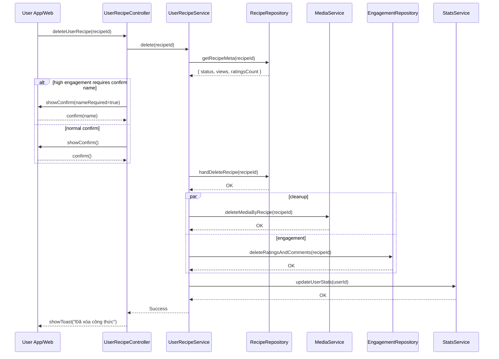

# Template Đặc Tả SEQUENCE DIAGRAM (SD)

## I. Thông Tin Tổng Quan (Header Information)

| Trường (Field) | Nội dung | Ghi chú/Ví dụ |
| :--- | :--- | :--- |
| **SD ID** | SD-UCS03-4 | Tương ứng UCS03-4 |
| **Related UC ID** | UCS03-4 | Xóa công thức đã tạo |
| **SD Name** | Luồng xóa công thức người dùng |
| **Description** | Người dùng xóa công thức của mình; hệ thống xác nhận, kiểm tra ràng buộc, xóa DB/media, cập nhật thống kê; với công thức tương tác cao có xác nhận đặc biệt. |
| **Primary Actor** | User |
| **Phiên bản (Version)** | 0.1.0 |
| **Trạng thái (Status)** | Draft |
| **Tác giả (Author)** |  |
| **Ngày (Date)** |  |
| **Liên kết UC/BR/NFR** | `UC/UC3/UCS03-4_Xoa_cong_thuc_da_tao.md` |
| **Nguồn biểu đồ (Diagram Source)** | Mermaid |
| **Tài liệu liên quan (Related Artifacts)** | API Spec, DB `Recipe`, Media, `Rating`, `Comment` |

---

## II. Danh Sách Đối Tượng Tham Gia (Participants / Lifelines)

| ID | Tên Đối tượng | Stereotype | Ownership | Protocol | API Ver | Mô tả |
| :--- | :--- | :--- | :--- | :--- | :--- | :--- |
| L1 | User App/Web | Boundary | Client | HTTP | n/a | UI xác nhận xóa |
| L2 | UserRecipeController | Control | Core | Internal | v1 | Điều phối |
| L3 | UserRecipeService | Service | Core | Internal | v1 | Nghiệp vụ xóa |
| L4 | RecipeRepository | Entity/DAO | Data | SQL | n/a | Xóa công thức |
| L5 | MediaService | Service | Core | Internal | v1 | Xóa media |
| L6 | EngagementRepository | Entity/DAO | Data | SQL | n/a | Đánh giá/bình luận |
| L7 | StatsService | Service | Core | Internal | v1 | Cập nhật thống kê user |

---

## III. Biểu Đồ Sequence Diagram (Visual Model)

---

## IV. Đặc Tả Chi Tiết Luồng Tương Tác (Interaction Flow Specification)

### A. Luồng Thành công Chính (Basic Success Flow)

| STT | Hành động | Message | Sync/Async | Input | Output | Source | Target | Error/Timeout | Txn |
| :--- | :--- | :--- | :--- | :--- | :--- | :--- | :--- | :--- | :--- |
| 1 | Yêu cầu xóa | `deleteUserRecipe(recipeId)` | Sync | `{ recipeId }` | `200` | L1 | L2 | 401 | N/A |
| 2 | Đọc meta | `getRecipeMeta(...)` | Sync | `{ recipeId }` | `{ meta }` | L3 | L4 | 404/5xx | Đọc |
| 3 | Xác nhận | `showConfirm(...)` | Sync | `{ nameRequired? }` | `confirm` | L2 | L1 | - | N/A |
| 4 | Xóa DB | `hardDeleteRecipe(...)` | Sync | `{ recipeId }` | `OK` | L3 | L4 | 5xx | Ghi |
| 5 | Dọn dẹp | `deleteMedia.../deleteRatingsAndComments` | Async | `{ recipeId }` | `OK` | L3 | L5/L6 | 5xx | Ghi |
| 6 | Cập nhật thống kê | `updateUserStats(...)` | Async | `{ userId }` | `OK` | L3 | L7 | 5xx | Ghi |
| 7 | Phản hồi UI | `showToast(...)` | Sync | `{ message }` | UI updated | L2 | L1 | - | Kết thúc |

### B. Alternative/Exception Flows

| ID | Type | Guard | Affect | Error | Recovery | UI Message | Telemetry |
| :--- | :--- | :--- | :--- | :--- | :--- | :--- | :--- |
| EF-1 | [alt] | Không có quyền | Thay thế 3-7 | FORBIDDEN | Dừng | "Bạn không có quyền xóa" | log: warn |
| EF-2 | [alt] | Nhập sai tên | Thay thế 4-7 | NAME_MISMATCH | Nhập lại | "Tên không khớp" | log: warn |
| EF-3 | [alt] | Lỗi DB | Thay thế 7 | DB_ERROR | Retry | "Không thể xóa" | log: error |

---

## V. Ghi Chú & Ràng Buộc

| Trường | Chi tiết |
| :--- | :--- |
| Business Rules | Xác nhận đặc biệt với công thức tương tác cao |
| Reliability | Dọn dẹp media/engagement an toàn |

---

## VI. Tác Động Dữ Liệu

| Bảng | Hành động | Trường |
| :--- | :--- | :--- |
| `Recipe` | DELETE | all |
| `Media` | DELETE | by recipeId |
| `Rating/Comment` | DELETE | by recipeId |

---

## VII. Giả Định & Câu Hỏi Mở

- Giả định: Có soft delete tùy chính sách.
- Câu hỏi mở: Ngưỡng “tương tác cao” là gì?

---

## VIII. Nguồn Biểu Đồ

- Mermaid embedded ở mục III.

