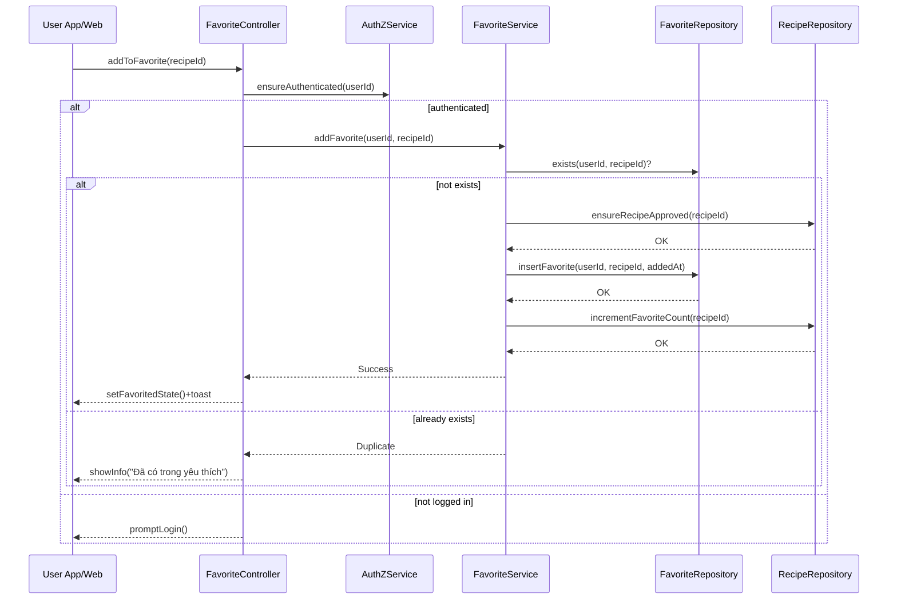

# Template Đặc Tả SEQUENCE DIAGRAM (SD)

## I. Thông Tin Tổng Quan (Header Information)

| Trường (Field) | Nội dung | Ghi chú/Ví dụ |
| :--- | :--- | :--- |
| **SD ID** | SD-UCS04-1 | Tương ứng UCS04-1 |
| **Related UC ID** | UCS04-1 | Thêm công thức vào Yêu thích |
| **SD Name** | Luồng thêm công thức vào Yêu thích |
| **Description** | Người dùng bấm yêu thích; hệ thống kiểm tra điều kiện, ghi vào bảng yêu thích, cập nhật đếm yêu thích và phản hồi UI. |
| **Primary Actor** | User |
| **Phiên bản (Version)** | 0.1.0 |
| **Trạng thái (Status)** | Draft |
| **Tác giả (Author)** |  |
| **Ngày (Date)** |  |
| **Liên kết UC/BR/NFR** | `UC/UC4/UCS04-1_Them_cong_thuc_vao_yeu_thich.md` |
| **Nguồn biểu đồ (Diagram Source)** | Mermaid |
| **Tài liệu liên quan (Related Artifacts)** | API Spec, DB `Favorite`, `Recipe` |

---

## II. Danh Sách Đối Tượng Tham Gia (Participants / Lifelines)

| ID | Tên Đối tượng | Stereotype | Ownership | Protocol | API Ver | Mô tả |
| :--- | :--- | :--- | :--- | :--- | :--- | :--- |
| L1 | User App/Web | Boundary | Client | HTTP | n/a | UI chi tiết/danh sách |
| L2 | FavoriteController | Control | Core | Internal | v1 | Điều phối add favorite |
| L3 | AuthZService | Service | Core | Internal | v1 | Kiểm tra login/quyền |
| L4 | FavoriteService | Service | Core | Internal | v1 | Kiểm tra điều kiện & ghi DB |
| L5 | FavoriteRepository | Entity/DAO | Data | SQL | n/a | Ghi bản ghi yêu thích |
| L6 | RecipeRepository | Entity/DAO | Data | SQL | n/a | Cập nhật/lấy đếm yêu thích |

---

## III. Biểu Đồ Sequence Diagram (Visual Model)

---

## IV. Đặc Tả Chi Tiết Luồng Tương Tác (Interaction Flow Specification)

### A. Luồng Thành công Chính (Basic Success Flow)

| STT | Hành động | Message | Sync/Async | Input | Output | Source | Target | Error/Timeout | Txn |
| :--- | :--- | :--- | :--- | :--- | :--- | :--- | :--- | :--- | :--- |
| 1 | Yêu cầu thêm | `addToFavorite(recipeId)` | Sync | `{ recipeId }` | `200` | L1 | L2 | 401 | N/A |
| 2 | Kiểm tra login | `ensureAuthenticated(userId)` | Sync | `{ userId }` | `OK` | L2 | L3 | 401 | N/A |
| 3 | Kiểm tra tồn tại | `exists(userId, recipeId)` | Sync | `{ u, r }` | `{ bool }` | L4 | L5 | 5xx | Đọc |
| 4 | Kiểm tra trạng thái | `ensureRecipeApproved(...)` | Sync | `{ recipeId }` | `OK` | L4 | L6 | 404/409 | Đọc |
| 5 | Ghi yêu thích | `insertFavorite(...)` | Sync | `{ u, r, t }` | `OK` | L4 | L5 | 5xx | Ghi |
| 6 | Tăng đếm | `incrementFavoriteCount(...)` | Async | `{ recipeId }` | `OK` | L4 | L6 | 5xx | Ghi |
| 7 | Phản hồi UI | `setFavoritedState()` | Sync | `-` | UI updated | L2 | L1 | - | Kết thúc |

### B. Alternative/Exception Flows

| ID | Type | Guard | Affect | Error | Recovery | UI Message | Telemetry |
| :--- | :--- | :--- | :--- | :--- | :--- | :--- | :--- |
| EF-1 | [alt] | Đã tồn tại | Thay thế 4-7 | DUPLICATE | No-op | "Đã có trong yêu thích" | log: info |
| EF-2 | [alt] | Đạt giới hạn | Thay thế 5-7 | LIMIT_REACHED | Hướng dẫn quản lý | "Đạt giới hạn 500" | log: warn |
| EF-3 | [alt] | Công thức chưa duyệt | Thay thế 5-7 | NOT_APPROVED | Ẩn nút | "Chưa được duyệt" | log: warn |
| EF-4 | [alt] | Lỗi DB | Thay thế 7 | DB_ERROR | Retry | "Không thể thêm" | log: error |

---

## V. Ghi Chú & Ràng Buộc

| Trường | Chi tiết |
| :--- | :--- |
| Business Rules | Tối đa 500/yêu thích; 1 user-1 recipe duy nhất |
| Observability | Telemetry: favorite_add, duplicate_detected |

---

## VI. Tác Động Dữ Liệu

| Bảng | Hành động | Trường |
| :--- | :--- | :--- |
| `Favorite` | INSERT | userId, recipeId, addedAt |
| `Recipe` | UPDATE | favoritesCount+1 |

---

## VII. Giả Định & Câu Hỏi Mở

- Giả định: Tăng đếm bất đồng bộ.
- Câu hỏi mở: Có cần cache trạng thái yêu thích theo user?

---

## VIII. Nguồn Biểu Đồ

- Mermaid embedded ở mục III.

