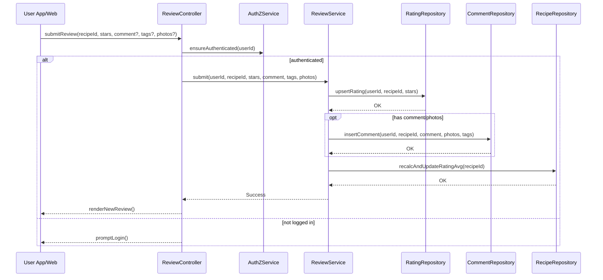

# Template Đặc Tả SEQUENCE DIAGRAM (SD)

## I. Thông Tin Tổng Quan (Header Information)

| Trường (Field) | Nội dung | Ghi chú/Ví dụ |
| :--- | :--- | :--- |
| **SD ID** | SD-UCS04-4 | Tương ứng UCS04-4 |
| **Related UC ID** | UCS04-4 | Gửi đánh giá và bình luận |
| **SD Name** | Luồng gửi đánh giá và bình luận |
| **Description** | Người dùng chấm sao/viết bình luận; hệ thống validate, lưu review/comment, cập nhật điểm trung bình và hiển thị ngay. |
| **Primary Actor** | User |
| **Phiên bản (Version)** | 0.1.0 |
| **Trạng thái (Status)** | Draft |
| **Tác giả (Author)** |  |
| **Ngày (Date)** |  |
| **Liên kết UC/BR/NFR** | `UC/UC4/UCS04-4_Gui_danh_gia_va_binh_luan.md` |
| **Nguồn biểu đồ (Diagram Source)** | Mermaid |
| **Tài liệu liên quan (Related Artifacts)** | API Spec, DB `Rating`, `Comment`, `Recipe` |

---

## II. Danh Sách Đối Tượng Tham Gia (Participants / Lifelines)

| ID | Tên Đối tượng | Stereotype | Ownership | Protocol | API Ver | Mô tả |
| :--- | :--- | :--- | :--- | :--- | :--- | :--- |
| L1 | User App/Web | Boundary | Client | HTTP | n/a | UI review/comment |
| L2 | ReviewController | Control | Core | Internal | v1 | Điều phối |
| L3 | AuthZService | Service | Core | Internal | v1 | Kiểm tra login |
| L4 | ReviewService | Service | Core | Internal | v1 | Validate & lưu |
| L5 | RatingRepository | Entity/DAO | Data | SQL | n/a | Lưu/đọc điểm |
| L6 | CommentRepository | Entity/DAO | Data | SQL | n/a | Lưu/đọc bình luận |
| L7 | RecipeRepository | Entity/DAO | Data | SQL | n/a | Cập nhật ratingAvg |

---

## III. Biểu Đồ Sequence Diagram (Visual Model)

---

## IV. Đặc Tả Chi Tiết Luồng Tương Tác (Interaction Flow Specification)

### A. Luồng Thành công Chính (Basic Success Flow)

| STT | Hành động | Message | Sync/Async | Input | Output | Source | Target | Error/Timeout | Txn |
| :--- | :--- | :--- | :--- | :--- | :--- | :--- | :--- | :--- | :--- |
| 1 | Gửi form | `submitReview(...)` | Sync | `{ stars, comment? }` | `200` | L1 | L2 | 401 | N/A |
| 2 | Kiểm tra login | `ensureAuthenticated(userId)` | Sync | `{ userId }` | `OK` | L2 | L3 | 401 | N/A |
| 3 | Ghi rating | `upsertRating(...)` | Sync | `{ u, r, stars }` | `OK` | L4 | L5 | 5xx | Ghi |
| 4 | Ghi comment | `insertComment(...)` | Sync | `{ u, r, text, photos }` | `OK` | L4 | L6 | 5xx | Ghi |
| 5 | Cập nhật avg | `recalcAndUpdateRatingAvg(...)` | Async | `{ recipeId }` | `OK` | L4 | L7 | 5xx | Ghi |
| 6 | Phản hồi UI | `renderNewReview()` | Sync | `{ review }` | UI updated | L2 | L1 | - | Kết thúc |

### B. Alternative/Exception Flows

| ID | Type | Guard | Affect | Error | Recovery | UI Message | Telemetry |
| :--- | :--- | :--- | :--- | :--- | :--- | :--- | :--- |
| EF-1 | [alt] | Chưa chọn sao | Thay thế 3-6 | MISSING_STARS | Nhắc chọn | "Chọn số sao" | log: warn |
| EF-2 | [alt] | Đã đánh giá trước | Thay thế 4 | DUPLICATE | Chuyển sang cập nhật | "Bạn đã đánh giá" | log: info |
| EF-3 | [alt] | Nội dung vi phạm | Thay thế 4-6 | CONTENT_VIOLATION | Sửa nội dung | "Nội dung không phù hợp" | log: warn |
| EF-4 | [alt] | Lỗi DB | Thay thế 6 | DB_ERROR | Retry | "Không thể gửi" | log: error |

---

## V. Ghi Chú & Ràng Buộc

| Trường | Chi tiết |
| :--- | :--- |
| Business Rules | 1 user/recipe: 1 rating (upsert); comment ≤1000 |
| Security | Sanitize, scan ảnh đính kèm |

---

## VI. Tác Động Dữ Liệu

| Bảng | Hành động | Trường |
| :--- | :--- | :--- |
| `Rating` | UPSERT | userId, recipeId, stars |
| `Comment` | INSERT | userId, recipeId, text, photos |
| `Recipe` | UPDATE | ratingAvg, ratingCount |

---

## VII. Giả Định & Câu Hỏi Mở

- Giả định: Recalculate avg bất đồng bộ.
- Câu hỏi mở: Có kiểm duyệt AI trước khi hiển thị?

---

## VIII. Nguồn Biểu Đồ

- Mermaid embedded ở mục III.

