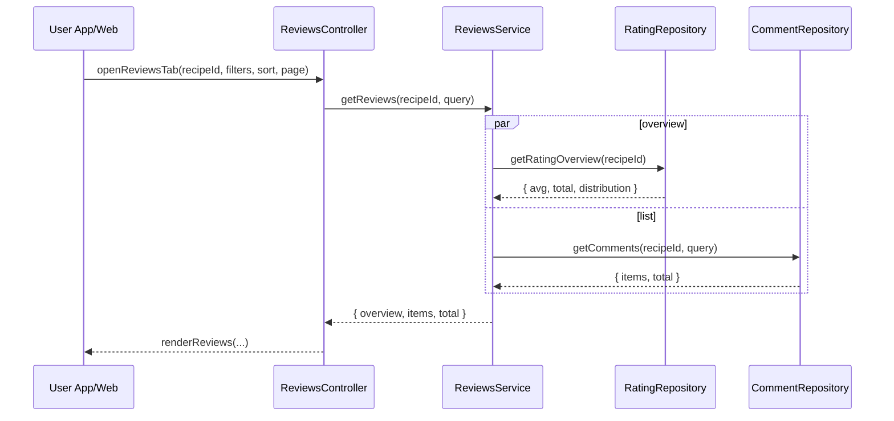

# Template Đặc Tả SEQUENCE DIAGRAM (SD)

## I. Thông Tin Tổng Quan (Header Information)

| Trường (Field) | Nội dung | Ghi chú/Ví dụ |
| :--- | :--- | :--- |
| **SD ID** | SD-UCS04-5 | Tương ứng UCS04-5 |
| **Related UC ID** | UCS04-5 | Xem đánh giá và bình luận |
| **SD Name** | Luồng xem đánh giá và bình luận |
| **Description** | Người dùng xem tab đánh giá; hệ thống truy vấn tổng quan, danh sách review/comment, hỗ trợ lọc/sắp xếp và phân trang. |
| **Primary Actor** | User |
| **Phiên bản (Version)** | 0.1.0 |
| **Trạng thái (Status)** | Draft |
| **Tác giả (Author)** |  |
| **Ngày (Date)** |  |
| **Liên kết UC/BR/NFR** | `UC/UC4/UCS04-5_Xem_danh_gia_va_binh_luan.md` |
| **Nguồn biểu đồ (Diagram Source)** | Mermaid |
| **Tài liệu liên quan (Related Artifacts)** | API Spec, DB `Rating`, `Comment` |

---

## II. Danh Sách Đối Tượng Tham Gia (Participants / Lifelines)

| ID | Tên Đối tượng | Stereotype | Ownership | Protocol | API Ver | Mô tả |
| :--- | :--- | :--- | :--- | :--- | :--- | :--- |
| L1 | User App/Web | Boundary | Client | HTTP | n/a | UI reviews tab |
| L2 | ReviewsController | Control | Core | Internal | v1 | Điều phối |
| L3 | ReviewsService | Service | Core | Internal | v1 | Tổng hợp dữ liệu |
| L4 | RatingRepository | Entity/DAO | Data | SQL | n/a | Tổng quan rating |
| L5 | CommentRepository | Entity/DAO | Data | SQL | n/a | Danh sách review/comment |

---

## III. Biểu Đồ Sequence Diagram (Visual Model)

---

## IV. Đặc Tả Chi Tiết Luồng Tương Tác (Interaction Flow Specification)

### A. Luồng Thành công Chính (Basic Success Flow)

| STT | Hành động | Message | Sync/Async | Input | Output | Source | Target | Error/Timeout | Txn |
| :--- | :--- | :--- | :--- | :--- | :--- | :--- | :--- | :--- | :--- |
| 1 | Mở tab | `openReviewsTab(...)` | Sync | `{ recipeId, query }` | `200` | L1 | L2 | 4xx | N/A |
| 2 | Tổng quan | `getRatingOverview(...)` | Sync | `{ recipeId }` | `{ avg, total, dist }` | L3 | L4 | 5xx | Đọc |
| 3 | Danh sách | `getComments(...)` | Sync | `{ recipeId, query }` | `{ items, total }` | L3 | L5 | 5xx | Đọc |
| 4 | Render | `renderReviews(...)` | Sync | `{ data }` | UI updated | L2 | L1 | - | N/A |

### B. Alternative/Exception Flows

| ID | Type | Guard | Affect | Error | Recovery | UI Message | Telemetry |
| :--- | :--- | :--- | :--- | :--- | :--- | :--- | :--- |
| EF-1 | [alt] | Chưa có review | Thay thế 4 | EMPTY | Gợi ý viết review | "Chưa có đánh giá" | log: info |
| EF-2 | [alt] | Lỗi tải | Thay thế 4 | SERVER_ERROR | Retry | "Không thể tải" | log: error |

---

## V. Ghi Chú & Ràng Buộc

| Trường | Chi tiết |
| :--- | :--- |
| Performance | Phân trang 10/trang; cache 5 phút |
| Security | Sanitize nội dung |

---

## VI. Tác Động Dữ Liệu

| Bảng | Hành động | Trường |
| :--- | :--- | :--- |
| `Rating` | READ | overview |
| `Comment` | READ | list |

---

## VII. Giả Định & Câu Hỏi Mở

- Giả định: Có nút “Hữu ích” cho review.
- Câu hỏi mở: Có ẩn danh người đánh giá theo cài đặt?

---

## VIII. Nguồn Biểu Đồ

- Mermaid embedded ở mục III.

