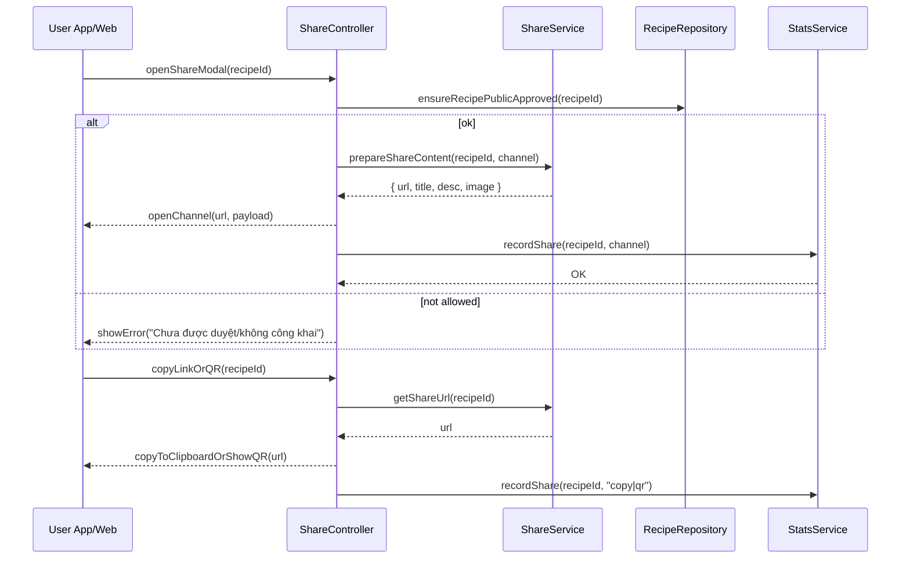

# Template Đặc Tả SEQUENCE DIAGRAM (SD)

## I. Thông Tin Tổng Quan (Header Information)

| Trường (Field) | Nội dung | Ghi chú/Ví dụ |
| :--- | :--- | :--- |
| **SD ID** | SD-UCS04-6 | Tương ứng UCS04-6 |
| **Related UC ID** | UCS04-6 | Chia sẻ công thức |
| **SD Name** | Luồng chia sẻ công thức |
| **Description** | Người dùng bấm chia sẻ; hệ thống tạo link/chuẩn bị nội dung theo kênh, mở ứng dụng mạng xã hội/email hoặc copy link/QR, cập nhật thống kê. |
| **Primary Actor** | User |
| **Phiên bản (Version)** | 0.1.0 |
| **Trạng thái (Status)** | Draft |
| **Tác giả (Author)** |  |
| **Ngày (Date)** |  |
| **Liên kết UC/BR/NFR** | `UC/UC4/UCS04-6_Chia_se_cong_thuc.md` |
| **Nguồn biểu đồ (Diagram Source)** | Mermaid |
| **Tài liệu liên quan (Related Artifacts)** | API Spec, `ShareService`, DB `Recipe` |

---

## II. Danh Sách Đối Tượng Tham Gia (Participants / Lifelines)

| ID | Tên Đối tượng | Stereotype | Ownership | Protocol | API Ver | Mô tả |
| :--- | :--- | :--- | :--- | :--- | :--- | :--- |
| L1 | User App/Web | Boundary | Client | HTTP | n/a | UI share modal |
| L2 | ShareController | Control | Core | Internal | v1 | Điều phối |
| L3 | ShareService | Service | Core | Internal | v1 | Tạo link/chuẩn bị nội dung |
| L4 | RecipeRepository | Entity/DAO | Data | SQL | n/a | Kiểm tra công khai/duyệt |
| L5 | StatsService | Service | Core | Internal | v1 | Cập nhật thống kê chia sẻ |

---

## III. Biểu Đồ Sequence Diagram (Visual Model)

---

## IV. Đặc Tả Chi Tiết Luồng Tương Tác (Interaction Flow Specification)

### A. Luồng Thành công Chính (Basic Success Flow)

| STT | Hành động | Message | Sync/Async | Input | Output | Source | Target | Error/Timeout | Txn |
| :--- | :--- | :--- | :--- | :--- | :--- | :--- | :--- | :--- | :--- |
| 1 | Mở share | `openShareModal(recipeId)` | Sync | `{ recipeId }` | `200` | L1 | L2 | 4xx | N/A |
| 2 | Kiểm tra | `ensureRecipePublicApproved(...)` | Sync | `{ recipeId }` | `OK` | L2 | L4 | 404/409 | Đọc |
| 3 | Chuẩn bị nội dung | `prepareShareContent(...)` | Sync | `{ recipeId, channel }` | `{ url, meta }` | L2 | L3 | 5xx | - |
| 4 | Mở kênh/copy | `openChannel(...)` | Sync | `{ payload }` | UI updated | L2 | L1 | - | N/A |
| 5 | Ghi thống kê | `recordShare(...)` | Async | `{ recipeId, channel }` | `OK` | L2 | L5 | 5xx | Ghi |

### B. Alternative/Exception Flows

| ID | Type | Guard | Affect | Error | Recovery | UI Message | Telemetry |
| :--- | :--- | :--- | :--- | :--- | :--- | :--- | :--- |
| EF-1 | [alt] | Chưa duyệt/không công khai | Thay thế 3-5 | NOT_ALLOWED | Chặn | "Không thể chia sẻ" | log: warn |
| EF-2 | [alt] | Lỗi tạo link | Thay thế 4-5 | LINK_ERROR | Retry | "Không thể tạo link" | log: error |
| EF-3 | [alt] | Lỗi mở app | Thay thế 5 | CHANNEL_ERROR | Đề xuất copy | "Không thể mở ứng dụng" | log: warn |

---

## V. Ghi Chú & Ràng Buộc

| Trường | Chi tiết |
| :--- | :--- |
| Business Rules | Link trực tiếp trang chi tiết; nội dung có title/desc/image |
| Security | Link an toàn, không lộ thông tin nhạy cảm |

---

## VI. Tác Động Dữ Liệu

| Bảng | Hành động | Trường |
| :--- | :--- | :--- |
| `Recipe` | READ | visibility/state |
| `ShareStats` | INSERT | recipeId, channel, timestamp |

---

## VII. Giả Định & Câu Hỏi Mở

- Giả định: Có endpoint tạo QR/link ngắn.
- Câu hỏi mở: Có thống kê từng kênh chi tiết?

---

## VIII. Nguồn Biểu Đồ

- Mermaid embedded ở mục III.

