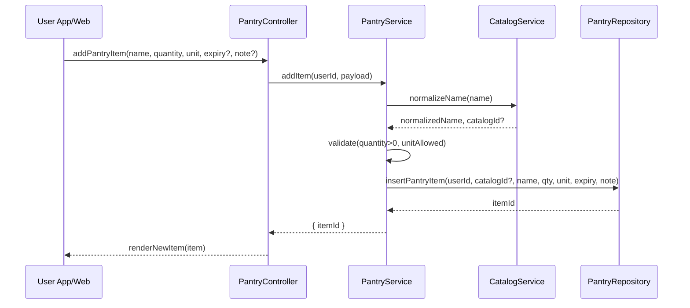

# Template Đặc Tả SEQUENCE DIAGRAM (SD)

## I. Thông Tin Tổng Quan (Header Information)

| Trường (Field) | Nội dung | Ghi chú/Ví dụ |
| :--- | :--- | :--- |
| **SD ID** | SD-UCS05-1 | Tương ứng UCS05-1 |
| **Related UC ID** | UCS05-1 | Thêm nguyên liệu vào tủ |
| **SD Name** | Luồng thêm nguyên liệu vào tủ |
| **Description** | Người dùng thêm nguyên liệu; hệ thống validate, chuẩn hóa tên/nghiệp vụ, ghi vào kho cá nhân và hiển thị ngay. |
| **Primary Actor** | User |
| **Phiên bản (Version)** | 0.1.0 |
| **Trạng thái (Status)** | Draft |
| **Tác giả (Author)** |  |
| **Ngày (Date)** |  |
| **Liên kết UC/BR/NFR** | `UC/UC5/UCS05-1_Them_nguyen_lieu_vao_tu.md` |
| **Nguồn biểu đồ (Diagram Source)** | Mermaid |
| **Tài liệu liên quan (Related Artifacts)** | API Spec, DB `PantryItem`, `IngredientCatalog` |

---

## II. Danh Sách Đối Tượng Tham Gia (Participants / Lifelines)

| ID | Tên Đối tượng | Stereotype | Ownership | Protocol | API Ver | Mô tả |
| :--- | :--- | :--- | :--- | :--- | :--- | :--- |
| L1 | User App/Web | Boundary | Client | HTTP | n/a | UI tủ lạnh ảo |
| L2 | PantryController | Control | Core | Internal | v1 | Điều phối |
| L3 | PantryService | Service | Core | Internal | v1 | Validate & chuẩn hóa & ghi |
| L4 | CatalogService | Service | Core | Internal | v1 | Chuẩn hóa tên/nguyên liệu |
| L5 | PantryRepository | Entity/DAO | Data | SQL | n/a | Lưu `PantryItem` |

---

## III. Biểu Đồ Sequence Diagram (Visual Model)

---

## IV. Đặc Tả Chi Tiết Luồng Tương Tác (Interaction Flow Specification)

### A. Luồng Thành công Chính (Basic Success Flow)

| STT | Hành động | Message | Sync/Async | Input | Output | Source | Target | Error/Timeout | Txn |
| :--- | :--- | :--- | :--- | :--- | :--- | :--- | :--- | :--- | :--- |
| 1 | Submit | `addPantryItem(...)` | Sync | `{ name, qty, unit, expiry?, note? }` | `200` | L1 | L2 | 401 | N/A |
| 2 | Chuẩn hóa | `normalizeName(...)` | Sync | `{ name }` | `{ normalized, catalogId? }` | L3 | L4 | 4xx | - |
| 3 | Ghi DB | `insertPantryItem(...)` | Sync | `{ data }` | `{ itemId }` | L3 | L5 | 5xx | Ghi |
| 4 | Render | `renderNewItem(...)` | Sync | `{ item }` | UI updated | L2 | L1 | - | Kết thúc |

### B. Alternative/Exception Flows

| ID | Type | Guard | Affect | Error | Recovery | UI Message | Telemetry |
| :--- | :--- | :--- | :--- | :--- | :--- | :--- | :--- |
| AF-1 | [opt] | Thêm nhanh từ gợi ý | Thay thế 2 | - | Prefill | - | log: info |
| AF-2 | [opt] | Barcode | Thay thế 2 | - | Gợi ý danh mục | - | log: info |
| EF-1 | [alt] | Trùng nguyên liệu | Thay thế 3-4 | DUPLICATE | Gộp số lượng | "Gộp vào mục sẵn có?" | log: warn |
| EF-2 | [alt] | Số lượng không hợp lệ | Thay thế 3-4 | INVALID_QUANTITY | Sửa số | "Số lượng phải > 0" | log: warn |
| EF-3 | [alt] | Lỗi DB | Thay thế 4 | DB_ERROR | Retry | "Không thể thêm" | log: error |

---

## V. Ghi Chú & Ràng Buộc

| Trường | Chi tiết |
| :--- | :--- |
| Business Rules | Ưu tiên danh mục chuẩn; audit addedAt |
| Usability | Autocomplete, nhập nhanh |

---

## VI. Tác Động Dữ Liệu

| Bảng | Hành động | Trường |
| :--- | :--- | :--- |
| `PantryItem` | INSERT | userId, catalogId?, name, qty, unit, expiry, note |

---

## VII. Giả Định & Câu Hỏi Mở

- Giả định: FEFO cho gộp; có audit trail.
- Câu hỏi mở: Cho phép nguyên liệu custom luôn hay cần review?

---

## VIII. Nguồn Biểu Đồ

- Mermaid embedded ở mục III.

