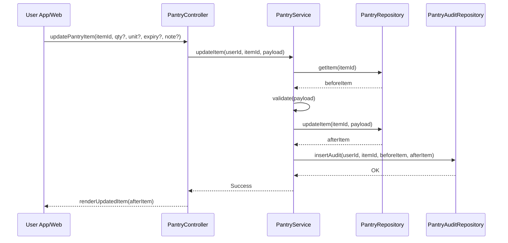

# Template Đặc Tả SEQUENCE DIAGRAM (SD)

## I. Thông Tin Tổng Quan (Header Information)

| Trường (Field) | Nội dung | Ghi chú/Ví dụ |
| :--- | :--- | :--- |
| **SD ID** | SD-UCS05-3 | Tương ứng UCS05-3 |
| **Related UC ID** | UCS05-3 | Cập nhật số lượng nguyên liệu |
| **SD Name** | Luồng cập nhật nguyên liệu |
| **Description** | Người dùng chỉnh sửa số lượng/đơn vị/ngày hết hạn; hệ thống validate, cập nhật DB, ghi audit và hiển thị ngay. |
| **Primary Actor** | User |
| **Phiên bản (Version)** | 0.1.0 |
| **Trạng thái (Status)** | Draft |
| **Tác giả (Author)** |  |
| **Ngày (Date)** |  |
| **Liên kết UC/BR/NFR** | `UC/UC5/UCS05-3_Cap_nhat_so_luong_nguyen_lieu.md` |
| **Nguồn biểu đồ (Diagram Source)** | Mermaid |
| **Tài liệu liên quan (Related Artifacts)** | API Spec, DB `PantryItem`, `PantryAudit` |

---

## II. Danh Sách Đối Tượng Tham Gia (Participants / Lifelines)

| ID | Tên Đối tượng | Stereotype | Ownership | Protocol | API Ver | Mô tả |
| :--- | :--- | :--- | :--- | :--- | :--- | :--- |
| L1 | User App/Web | Boundary | Client | HTTP | n/a | UI chỉnh sửa |
| L2 | PantryController | Control | Core | Internal | v1 | Điều phối |
| L3 | PantryService | Service | Core | Internal | v1 | Validate & cập nhật |
| L4 | PantryRepository | Entity/DAO | Data | SQL | n/a | Cập nhật item |
| L5 | PantryAuditRepository | Entity/DAO | Data | SQL | n/a | Ghi lịch sử thay đổi |

---

## III. Biểu Đồ Sequence Diagram (Visual Model)

---

## IV. Đặc Tả Chi Tiết Luồng Tương Tác (Interaction Flow Specification)

### A. Luồng Thành công Chính (Basic Success Flow)

| STT | Hành động | Message | Sync/Async | Input | Output | Source | Target | Error/Timeout | Txn |
| :--- | :--- | :--- | :--- | :--- | :--- | :--- | :--- | :--- | :--- |
| 1 | Submit | `updatePantryItem(...)` | Sync | `{ itemId, fields }` | `200` | L1 | L2 | 401 | N/A |
| 2 | Đọc trước | `getItem(itemId)` | Sync | `{ itemId }` | `{ before }` | L3 | L4 | 404/5xx | Đọc |
| 3 | Cập nhật | `updateItem(itemId, payload)` | Sync | `{ fields }` | `{ after }` | L3 | L4 | 5xx | Ghi |
| 4 | Audit | `insertAudit(...)` | Async | `{ before, after }` | `OK` | L3 | L5 | 5xx | Ghi |
| 5 | Render | `renderUpdatedItem(...)` | Sync | `{ after }` | UI updated | L2 | L1 | - | Kết thúc |

### B. Alternative/Exception Flows

| ID | Type | Guard | Affect | Error | Recovery | UI Message | Telemetry |
| :--- | :--- | :--- | :--- | :--- | :--- | :--- | :--- |
| EF-1 | [alt] | Không tồn tại | Thay thế 3-5 | NOT_FOUND | Làm mới | "Nguyên liệu không tồn tại" | log: warn |
| EF-2 | [alt] | Số lượng không hợp lệ | Thay thế 3-5 | INVALID_QUANTITY | Sửa số | "Số lượng không hợp lệ" | log: warn |
| EF-3 | [alt] | Xung đột cập nhật | Thay thế 5 | CONFLICT | Refresh | "Đã thay đổi ở nơi khác" | log: warn |

---

## V. Ghi Chú & Ràng Buộc

| Trường | Chi tiết |
| :--- | :--- |
| Business Rules | Qty ≥0; quy đổi đơn vị chuẩn; cảnh báo FEFO |
| Reliability | Lưu audit trước/sau |

---

## VI. Tác Động Dữ Liệu

| Bảng | Hành động | Trường |
| :--- | :--- | :--- |
| `PantryItem` | UPDATE | qty, unit, expiry, note |
| `PantryAudit` | INSERT | before, after |

---

## VII. Giả Định & Câu Hỏi Mở

- Giả định: Inline update hỗ trợ +/-. 
- Câu hỏi mở: Có batch update phần trăm?

---

## VIII. Nguồn Biểu Đồ

- Mermaid embedded ở mục III.

