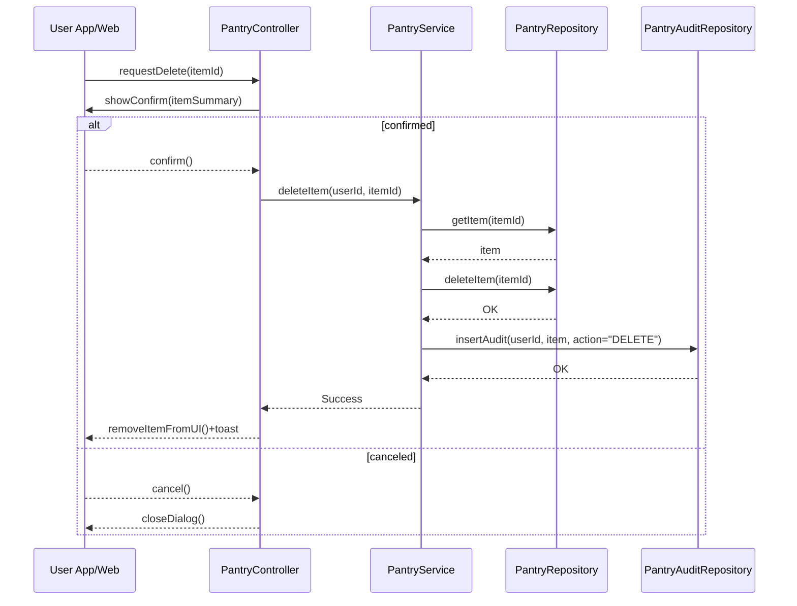

# Template Đặc Tả SEQUENCE DIAGRAM (SD)

## I. Thông Tin Tổng Quan (Header Information)

| Trường (Field) | Nội dung | Ghi chú/Ví dụ |
| :--- | :--- | :--- |
| **SD ID** | SD-UCS05-4 | Tương ứng UCS05-4 |
| **Related UC ID** | UCS05-4 | Xóa nguyên liệu khỏi tủ |
| **SD Name** | Luồng xóa nguyên liệu khỏi tủ |
| **Description** | Người dùng xóa nguyên liệu; hệ thống xác nhận, xóa bản ghi, ghi audit và cập nhật giao diện. |
| **Primary Actor** | User |
| **Phiên bản (Version)** | 0.1.0 |
| **Trạng thái (Status)** | Draft |
| **Tác giả (Author)** |  |
| **Ngày (Date)** |  |
| **Liên kết UC/BR/NFR** | `UC/UC5/UCS05-4_Xoa_nguyen_lieu_khoi_tu.md` |
| **Nguồn biểu đồ (Diagram Source)** | Mermaid |
| **Tài liệu liên quan (Related Artifacts)** | API Spec, DB `PantryItem`, `PantryAudit` |

---

## II. Danh Sách Đối Tượng Tham Gia (Participants / Lifelines)

| ID | Tên Đối tượng | Stereotype | Ownership | Protocol | API Ver | Mô tả |
| :--- | :--- | :--- | :--- | :--- | :--- | :--- |
| L1 | User App/Web | Boundary | Client | HTTP | n/a | UI xác nhận xóa |
| L2 | PantryController | Control | Core | Internal | v1 | Điều phối |
| L3 | PantryService | Service | Core | Internal | v1 | Nghiệp vụ xóa |
| L4 | PantryRepository | Entity/DAO | Data | SQL | n/a | Xóa item |
| L5 | PantryAuditRepository | Entity/DAO | Data | SQL | n/a | Ghi lịch sử xóa |

---

## III. Biểu Đồ Sequence Diagram (Visual Model)

---

## IV. Đặc Tả Chi Tiết Luồng Tương Tác (Interaction Flow Specification)

### A. Luồng Thành công Chính (Basic Success Flow)

| STT | Hành động | Message | Sync/Async | Input | Output | Source | Target | Error/Timeout | Txn |
| :--- | :--- | :--- | :--- | :--- | :--- | :--- | :--- | :--- | :--- |
| 1 | Xác nhận | `showConfirm(...)` | Sync | `{ item }` | `confirm` | L2 | L1 | - | N/A |
| 2 | Xóa DB | `deleteItem(itemId)` | Sync | `{ itemId }` | `OK` | L3 | L4 | 5xx | Ghi |
| 3 | Audit | `insertAudit(...)` | Async | `{ item, action }` | `OK` | L3 | L5 | 5xx | Ghi |
| 4 | Render | `removeItemFromUI()` | Sync | `{ id }` | UI updated | L2 | L1 | - | Kết thúc |

### B. Alternative/Exception Flows

| ID | Type | Guard | Affect | Error | Recovery | UI Message | Telemetry |
| :--- | :--- | :--- | :--- | :--- | :--- | :--- | :--- |
| AF-1 | [opt] | Xóa hàng loạt | Thay thế 2-4 | - | Lặp danh sách | - | log: info |
| EF-1 | [alt] | Không tồn tại | Thay thế 2-4 | NOT_FOUND | Làm mới | "Nguyên liệu không tồn tại" | log: warn |
| EF-2 | [alt] | Lỗi DB | Thay thế 4 | DB_ERROR | Retry | "Không thể xóa" | log: error |

---

## V. Ghi Chú & Ràng Buộc

| Trường | Chi tiết |
| :--- | :--- |
| Security | Chỉ chủ tủ được xóa |
| Reliability | Không để lại bản ghi mồ côi, ghi audit |

---

## VI. Tác Động Dữ Liệu

| Bảng | Hành động | Trường |
| :--- | :--- | :--- |
| `PantryItem` | DELETE | by id |
| `PantryAudit` | INSERT | delete event |

---

## VII. Giả Định & Câu Hỏi Mở

- Giả định: Có xóa hàng loạt.
- Câu hỏi mở: Tự động xóa mục hết hạn sau X ngày?

---

## VIII. Nguồn Biểu Đồ

- Mermaid embedded ở mục III.

