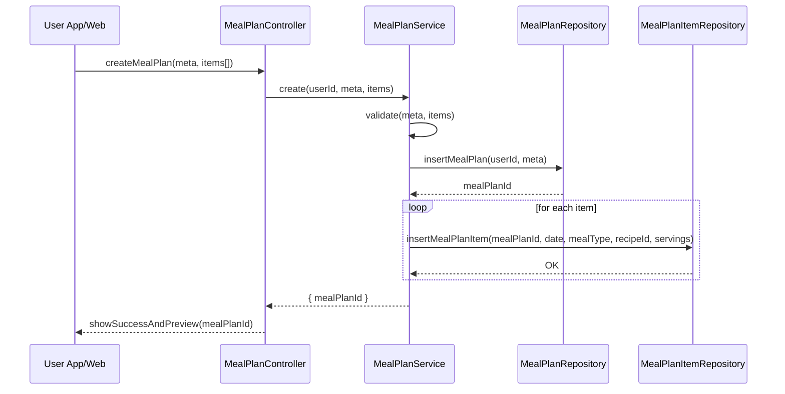

# Template Đặc Tả SEQUENCE DIAGRAM (SD)

## I. Thông Tin Tổng Quan (Header Information)

| Trường (Field) | Nội dung | Ghi chú/Ví dụ |
| :--- | :--- | :--- |
| **SD ID** | SD-UCS06-1 | Tương ứng UCS06-1 |
| **Related UC ID** | UCS06-1 | Tạo kế hoạch bữa ăn |
| **SD Name** | Luồng tạo kế hoạch bữa ăn |
| **Description** | Người dùng tạo kế hoạch (khoảng thời gian, chu kỳ, khẩu phần), thêm món theo ngày/bữa; hệ thống validate và lưu kế hoạch. |
| **Primary Actor** | User |
| **Phiên bản (Version)** | 0.1.0 |
| **Trạng thái (Status)** | Draft |
| **Tác giả (Author)** |  |
| **Ngày (Date)** |  |
| **Liên kết UC/BR/NFR** | `UC/UC6/UCS06-1_Tao_ke_hoach_bua_an.md` |
| **Nguồn biểu đồ (Diagram Source)** | Mermaid |
| **Tài liệu liên quan (Related Artifacts)** | API Spec, DB `MealPlan`, `MealPlanItem` |

---

## II. Danh Sách Đối Tượng Tham Gia (Participants / Lifelines)

| ID | Tên Đối tượng | Stereotype | Ownership | Protocol | API Ver | Mô tả |
| :--- | :--- | :--- | :--- | :--- | :--- | :--- |
| L1 | User App/Web | Boundary | Client | HTTP | n/a | UI kế hoạch |
| L2 | MealPlanController | Control | Core | Internal | v1 | Điều phối |
| L3 | MealPlanService | Service | Core | Internal | v1 | Validate & lưu |
| L4 | MealPlanRepository | Entity/DAO | Data | SQL | n/a | Lưu `MealPlan` |
| L5 | MealPlanItemRepository | Entity/DAO | Data | SQL | n/a | Lưu `MealPlanItem` |

---

## III. Biểu Đồ Sequence Diagram (Visual Model)

---

## IV. Đặc Tả Chi Tiết Luồng Tương Tác (Interaction Flow Specification)

### A. Luồng Thành công Chính (Basic Success Flow)

| STT | Hành động | Message | Sync/Async | Input | Output | Source | Target | Error/Timeout | Txn |
| :--- | :--- | :--- | :--- | :--- | :--- | :--- | :--- | :--- | :--- |
| 1 | Submit | `createMealPlan(...)` | Sync | `{ meta, items[] }` | `200` | L1 | L2 | 401 | N/A |
| 2 | Validate | `validate(...)` | Sync | `{ meta, items }` | `ok` | L3 | L3 | 4xx | - |
| 3 | Lưu plan | `insertMealPlan(...)` | Sync | `{ userId, meta }` | `{ mealPlanId }` | L3 | L4 | 5xx | Ghi |
| 4 | Lưu item | `insertMealPlanItem(...)` | Sync | `{ planId, item }` | `OK` | L3 | L5 | 5xx | Ghi |
| 5 | Phản hồi | `showSuccessAndPreview(...)` | Sync | `{ planId }` | UI updated | L2 | L1 | - | Kết thúc |

### B. Alternative/Exception Flows

| ID | Type | Guard | Affect | Error | Recovery | UI Message | Telemetry |
| :--- | :--- | :--- | :--- | :--- | :--- | :--- | :--- |
| AF-1 | [opt] | Tạo từ template | Thay thế 2-4 | - | Prefill | "Đã nạp template" | log: info |
| AF-2 | [opt] | Gợi ý AI | Thay thế 2 | - | Fill bằng AI | "Đã gợi ý thực đơn" | log: info |
| EF-1 | [alt] | Khoảng thời gian sai | Thay thế 3-5 | INVALID_RANGE | Chọn lại | "Khoảng thời gian không hợp lệ" | log: warn |
| EF-2 | [alt] | Chưa có món | Thay thế 3-5 | EMPTY_ITEMS | Thêm món | "Thêm ít nhất 1 món" | log: warn |
| EF-3 | [alt] | Lỗi DB | Thay thế 5 | DB_ERROR | Retry | "Không thể lưu kế hoạch" | log: error |

---

## V. Ghi Chú & Ràng Buộc

| Trường | Chi tiết |
| :--- | :--- |
| Business Rules | Ít nhất 1 món; nhiều bữa/ngày; tùy chỉnh khẩu phần |
| Reliability | Tự động lưu nháp định kỳ |

---

## VI. Tác Động Dữ Liệu

| Bảng | Hành động | Trường |
| :--- | :--- | :--- |
| `MealPlan` | INSERT | userId, name, range, cycle, defaultServings |
| `MealPlanItem` | INSERT | planId, date, mealType, recipeId, servings |

---

## VII. Giả Định & Câu Hỏi Mở

- Giả định: Có thể lưu thành template.
- Câu hỏi mở: Có hỗ trợ bữa phụ linh hoạt?

---

## VIII. Nguồn Biểu Đồ

- Mermaid embedded ở mục III.

