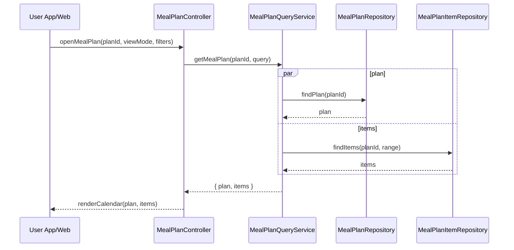

# Template Đặc Tả SEQUENCE DIAGRAM (SD)

## I. Thông Tin Tổng Quan (Header Information)

| Trường (Field) | Nội dung | Ghi chú/Ví dụ |
| :--- | :--- | :--- |
| **SD ID** | SD-UCS06-2 | Tương ứng UCS06-2 |
| **Related UC ID** | UCS06-2 | Xem kế hoạch bữa ăn |
| **SD Name** | Luồng xem kế hoạch bữa ăn |
| **Description** | Người dùng mở kế hoạch; hệ thống truy vấn plan và items, hiển thị theo lịch (ngày/tuần/tháng) với thao tác nhanh. |
| **Primary Actor** | User |
| **Phiên bản (Version)** | 0.1.0 |
| **Trạng thái (Status)** | Draft |
| **Tác giả (Author)** |  |
| **Ngày (Date)** |  |
| **Liên kết UC/BR/NFR** | `UC/UC6/UCS06-2_Xem_ke_hoach_bua_an.md` |
| **Nguồn biểu đồ (Diagram Source)** | Mermaid |
| **Tài liệu liên quan (Related Artifacts)** | API Spec, DB `MealPlan`, `MealPlanItem` |

---

## II. Danh Sách Đối Tượng Tham Gia (Participants / Lifelines)

| ID | Tên Đối tượng | Stereotype | Ownership | Protocol | API Ver | Mô tả |
| :--- | :--- | :--- | :--- | :--- | :--- | :--- |
| L1 | User App/Web | Boundary | Client | HTTP | n/a | UI lịch kế hoạch |
| L2 | MealPlanController | Control | Core | Internal | v1 | Điều phối |
| L3 | MealPlanQueryService | Service | Core | Internal | v1 | Truy vấn plan & items |
| L4 | MealPlanRepository | Entity/DAO | Data | SQL | n/a | Đọc plan |
| L5 | MealPlanItemRepository | Entity/DAO | Data | SQL | n/a | Đọc items |

---

## III. Biểu Đồ Sequence Diagram (Visual Model)

---

## IV. Đặc Tả Chi Tiết Luồng Tương Tác (Interaction Flow Specification)

### A. Luồng Thành công Chính (Basic Success Flow)

| STT | Hành động | Message | Sync/Async | Input | Output | Source | Target | Error/Timeout | Txn |
| :--- | :--- | :--- | :--- | :--- | :--- | :--- | :--- | :--- | :--- |
| 1 | Mở plan | `openMealPlan(...)` | Sync | `{ planId, viewMode }` | `200` | L1 | L2 | 401 | N/A |
| 2 | Đọc plan | `findPlan(planId)` | Sync | `{ planId }` | `{ plan }` | L3 | L4 | 404/5xx | Đọc |
| 3 | Đọc items | `findItems(planId, range)` | Sync | `{ planId, range }` | `{ items }` | L3 | L5 | 5xx | Đọc |
| 4 | Render | `renderCalendar(...)` | Sync | `{ plan, items }` | UI updated | L2 | L1 | - | N/A |

### B. Alternative/Exception Flows

| ID | Type | Guard | Affect | Error | Recovery | UI Message | Telemetry |
| :--- | :--- | :--- | :--- | :--- | :--- | :--- | :--- |
| EF-1 | [alt] | Chưa có plan | Thay thế 4 | EMPTY | Gợi ý tạo | "Bạn chưa có kế hoạch" | log: info |
| EF-2 | [alt] | Lỗi tải | Thay thế 4 | SERVER_ERROR | Retry | "Không thể tải kế hoạch" | log: error |

---

## V. Ghi Chú & Ràng Buộc

| Trường | Chi tiết |
| :--- | :--- |
| Usability | Kéo/thả, thao tác nhanh move/remove/copy |
| Security | Chỉ xem plan của chính user |

---

## VI. Tác Động Dữ Liệu

| Bảng | Hành động | Trường |
| :--- | :--- | :--- |
| `MealPlan` | READ | by id |
| `MealPlanItem` | READ | by planId, range |

---

## VII. Giả Định & Câu Hỏi Mở

- Giả định: Có in PDF/chia sẻ.
- Câu hỏi mở: So sánh 2 kế hoạch song song?

---

## VIII. Nguồn Biểu Đồ

- Mermaid embedded ở mục III.

