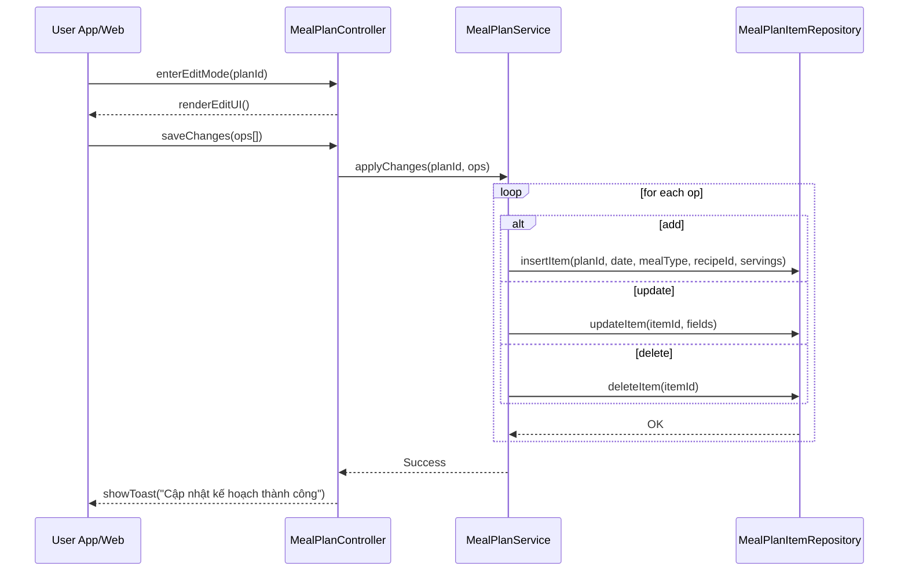

# Template Đặc Tả SEQUENCE DIAGRAM (SD)

## I. Thông Tin Tổng Quan (Header Information)

| Trường (Field) | Nội dung | Ghi chú/Ví dụ |
| :--- | :--- | :--- |
| **SD ID** | SD-UCS06-3 | Tương ứng UCS06-3 |
| **Related UC ID** | UCS06-3 | Chỉnh sửa kế hoạch bữa ăn |
| **SD Name** | Luồng chỉnh sửa kế hoạch bữa ăn |
| **Description** | Người dùng vào edit mode, kéo/thả/thêm/xóa/thay thế món, đổi khẩu phần; hệ thống validate và cập nhật plan. |
| **Primary Actor** | User |
| **Phiên bản (Version)** | 0.1.0 |
| **Trạng thái (Status)** | Draft |
| **Tác giả (Author)** |  |
| **Ngày (Date)** |  |
| **Liên kết UC/BR/NFR** | `UC/UC6/UCS06-3_Chinh_sua_ke_hoach_bua_an.md` |
| **Nguồn biểu đồ (Diagram Source)** | Mermaid |
| **Tài liệu liên quan (Related Artifacts)** | API Spec, DB `MealPlan`, `MealPlanItem` |

---

## II. Danh Sách Đối Tượng Tham Gia (Participants / Lifelines)

| ID | Tên Đối tượng | Stereotype | Ownership | Protocol | API Ver | Mô tả |
| :--- | :--- | :--- | :--- | :--- | :--- | :--- |
| L1 | User App/Web | Boundary | Client | HTTP | n/a | UI edit kế hoạch |
| L2 | MealPlanController | Control | Core | Internal | v1 | Điều phối |
| L3 | MealPlanService | Service | Core | Internal | v1 | Áp thay đổi/validate |
| L4 | MealPlanItemRepository | Entity/DAO | Data | SQL | n/a | Cập nhật/xóa/thêm item |

---

## III. Biểu Đồ Sequence Diagram (Visual Model)

---

## IV. Đặc Tả Chi Tiết Luồng Tương Tác (Interaction Flow Specification)

### A. Luồng Thành công Chính (Basic Success Flow)

| STT | Hành động | Message | Sync/Async | Input | Output | Source | Target | Error/Timeout | Txn |
| :--- | :--- | :--- | :--- | :--- | :--- | :--- | :--- | :--- | :--- |
| 1 | Vào edit | `enterEditMode(...)` | Sync | `{ planId }` | `200` | L1 | L2 | 401 | N/A |
| 2 | Lưu thay đổi | `saveChanges(ops[])` | Sync | `{ ops[] }` | `OK` | L1 | L2 | 4xx | N/A |
| 3 | Áp thay đổi | `applyChanges(...)` | Sync | `{ ops[] }` | `OK` | L2 | L3 | 5xx | Ghi |
| 4 | Cập nhật DB | `insert/update/deleteItem` | Sync | `{ fields }` | `OK` | L3 | L4 | 5xx | Ghi |
| 5 | Phản hồi | `showToast(...)` | Sync | `{ message }` | UI updated | L2 | L1 | - | Kết thúc |

### B. Alternative/Exception Flows

| ID | Type | Guard | Affect | Error | Recovery | UI Message | Telemetry |
| :--- | :--- | :--- | :--- | :--- | :--- | :--- | :--- |
| AF-1 | [opt] | Batch apply | Thay thế 4 | - | Vòng lặp nhóm | - | log: info |
| AF-2 | [opt] | Undo/Redo | Thay thế 3 | - | Stack thay đổi | - | log: info |
| EF-1 | [alt] | Xung đột | Thay thế 5 | CONFLICT | Refresh | "Kế hoạch đã thay đổi" | log: warn |
| EF-2 | [alt] | Lỗi DB | Thay thế 5 | DB_ERROR | Retry | "Không thể cập nhật" | log: error |

---

## V. Ghi Chú & Ràng Buộc

| Trường | Chi tiết |
| :--- | :--- |
| Usability | Kéo/thả mượt; hỗ trợ Undo/Redo |
| Reliability | Tự động lưu nháp định kỳ |

---

## VI. Tác Động Dữ Liệu

| Bảng | Hành động | Trường |
| :--- | :--- | :--- |
| `MealPlanItem` | INSERT/UPDATE/DELETE | fields |

---

## VII. Giả Định & Câu Hỏi Mở

- Giả định: Có batch apply.
- Câu hỏi mở: Audit thay đổi plan cần mức chi tiết nào?

---

## VIII. Nguồn Biểu Đồ

- Mermaid embedded ở mục III.

