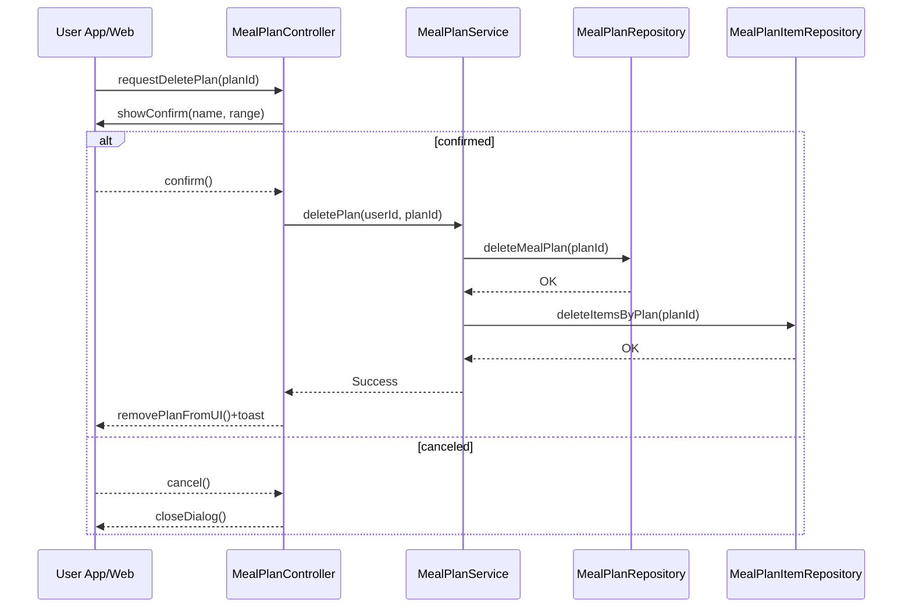

# Template Đặc Tả SEQUENCE DIAGRAM (SD)

## I. Thông Tin Tổng Quan (Header Information)

| Trường (Field) | Nội dung | Ghi chú/Ví dụ |
| :--- | :--- | :--- |
| **SD ID** | SD-UCS06-4 | Tương ứng UCS06-4 |
| **Related UC ID** | UCS06-4 | Xóa kế hoạch bữa ăn |
| **SD Name** | Luồng xóa kế hoạch bữa ăn |
| **Description** | Người dùng xác nhận xóa; hệ thống kiểm tra quyền sở hữu, xóa plan và items, cập nhật UI. |
| **Primary Actor** | User |
| **Phiên bản (Version)** | 0.1.0 |
| **Trạng thái (Status)** | Draft |
| **Tác giả (Author)** |  |
| **Ngày (Date)** |  |
| **Liên kết UC/BR/NFR** | `UC/UC6/UCS06-4_Xoa_ke_hoach_bua_an.md` |
| **Nguồn biểu đồ (Diagram Source)** | Mermaid |
| **Tài liệu liên quan (Related Artifacts)** | API Spec, DB `MealPlan`, `MealPlanItem` |

---

## II. Danh Sách Đối Tượng Tham Gia (Participants / Lifelines)

| ID | Tên Đối tượng | Stereotype | Ownership | Protocol | API Ver | Mô tả |
| :--- | :--- | :--- | :--- | :--- | :--- | :--- |
| L1 | User App/Web | Boundary | Client | HTTP | n/a | UI xác nhận xóa |
| L2 | MealPlanController | Control | Core | Internal | v1 | Điều phối |
| L3 | MealPlanService | Service | Core | Internal | v1 | Nghiệp vụ xóa |
| L4 | MealPlanRepository | Entity/DAO | Data | SQL | n/a | Xóa plan |
| L5 | MealPlanItemRepository | Entity/DAO | Data | SQL | n/a | Xóa items |

---

## III. Biểu Đồ Sequence Diagram (Visual Model)

---

## IV. Đặc Tả Chi Tiết Luồng Tương Tác (Interaction Flow Specification)

### A. Luồng Thành công Chính (Basic Success Flow)

| STT | Hành động | Message | Sync/Async | Input | Output | Source | Target | Error/Timeout | Txn |
| :--- | :--- | :--- | :--- | :--- | :--- | :--- | :--- | :--- | :--- |
| 1 | Xác nhận | `showConfirm(...)` | Sync | `{ name, range }` | `confirm` | L2 | L1 | - | N/A |
| 2 | Xóa plan | `deleteMealPlan(planId)` | Sync | `{ planId }` | `OK` | L3 | L4 | 5xx | Ghi |
| 3 | Xóa items | `deleteItemsByPlan(planId)` | Sync | `{ planId }` | `OK` | L3 | L5 | 5xx | Ghi |
| 4 | Render | `removePlanFromUI()` | Sync | `{ planId }` | UI updated | L2 | L1 | - | Kết thúc |

### B. Alternative/Exception Flows

| ID | Type | Guard | Affect | Error | Recovery | UI Message | Telemetry |
| :--- | :--- | :--- | :--- | :--- | :--- | :--- | :--- |
| AF-1 | [opt] | Xóa hàng loạt | Thay thế 2-3 | - | Lặp danh sách | - | log: info |
| EF-1 | [alt] | Không tồn tại | Thay thế 2-4 | NOT_FOUND | Làm mới | "Kế hoạch không tồn tại" | log: warn |
| EF-2 | [alt] | Lỗi DB | Thay thế 4 | DB_ERROR | Retry | "Không thể xóa" | log: error |

---

## V. Ghi Chú & Ràng Buộc

| Trường | Chi tiết |
| :--- | :--- |
| Security | Chỉ chủ sở hữu được xóa |
| Reliability | Xóa sạch items liên quan |

---

## VI. Tác Động Dữ Liệu

| Bảng | Hành động | Trường |
| :--- | :--- | :--- |
| `MealPlan` | DELETE | by id |
| `MealPlanItem` | DELETE | by planId |

---

## VII. Giả Định & Câu Hỏi Mở

- Giả định: Có archive thay delete vĩnh viễn.
- Câu hỏi mở: Cần xác nhận đặc biệt khi plan có nhiều items?

---

## VIII. Nguồn Biểu Đồ

- Mermaid embedded ở mục III.

