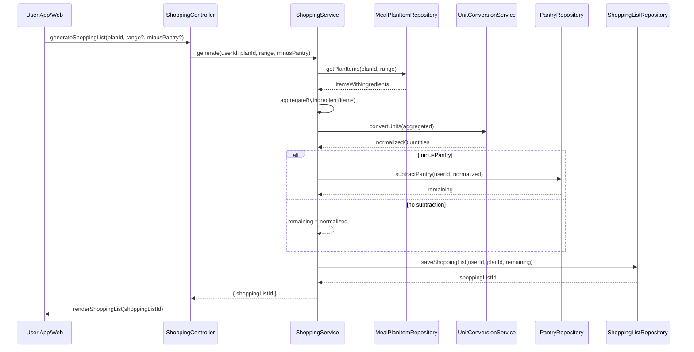

# Template Đặc Tả SEQUENCE DIAGRAM (SD)

## I. Thông Tin Tổng Quan (Header Information)

| Trường (Field) | Nội dung | Ghi chú/Ví dụ |
| :--- | :--- | :--- |
| **SD ID** | SD-UCS06-5 | Tương ứng UCS06-5 |
| **Related UC ID** | UCS06-5 | Tạo danh sách mua sắm từ kế hoạch |
| **SD Name** | Luồng tạo danh sách mua sắm |
| **Description** | Người dùng tạo shopping list từ kế hoạch; hệ thống tổng hợp nguyên liệu, gộp trùng, quy đổi đơn vị, trừ tủ (nếu chọn) và hiển thị theo nhóm. |
| **Primary Actor** | User |
| **Phiên bản (Version)** | 0.1.0 |
| **Trạng thái (Status)** | Draft |
| **Tác giả (Author)** |  |
| **Ngày (Date)** |  |
| **Liên kết UC/BR/NFR** | `UC/UC6/UCS06-5_Tao_danh_sach_mua_sam_tu_ke_hoach.md` |
| **Nguồn biểu đồ (Diagram Source)** | Mermaid |
| **Tài liệu liên quan (Related Artifacts)** | API Spec, DB `MealPlan`, `MealPlanItem`, `PantryItem`, Unit Conversion Table, `ShoppingList` |

---

## II. Danh Sách Đối Tượng Tham Gia (Participants / Lifelines)

| ID | Tên Đối tượng | Stereotype | Ownership | Protocol | API Ver | Mô tả |
| :--- | :--- | :--- | :--- | :--- | :--- | :--- |
| L1 | User App/Web | Boundary | Client | HTTP | n/a | UI shopping list |
| L2 | ShoppingController | Control | Core | Internal | v1 | Điều phối |
| L3 | ShoppingService | Service | Core | Internal | v1 | Tổng hợp & quy đổi |
| L4 | MealPlanItemRepository | Entity/DAO | Data | SQL | n/a | Lấy items trong phạm vi |
| L5 | UnitConversionService | Service | Core | Internal | v1 | Quy đổi đơn vị |
| L6 | PantryRepository | Entity/DAO | Data | SQL | n/a | Trừ tồn tủ (opt) |
| L7 | ShoppingListRepository | Entity/DAO | Data | SQL | n/a | Lưu danh sách mua sắm |

---

## III. Biểu Đồ Sequence Diagram (Visual Model)

---

## IV. Đặc Tả Chi Tiết Luồng Tương Tác (Interaction Flow Specification)

### A. Luồng Thành công Chính (Basic Success Flow)

| STT | Hành động | Message | Sync/Async | Input | Output | Source | Target | Error/Timeout | Txn |
| :--- | :--- | :--- | :--- | :--- | :--- | :--- | :--- | :--- | :--- |
| 1 | Yêu cầu tạo | `generateShoppingList(...)` | Sync | `{ planId, range?, minusPantry? }` | `200` | L1 | L2 | 401 | N/A |
| 2 | Lấy items | `getPlanItems(...)` | Sync | `{ planId, range }` | `{ items }` | L3 | L4 | 5xx | Đọc |
| 3 | Quy đổi | `convertUnits(...)` | Sync | `{ aggregated }` | `{ normalized }` | L3 | L5 | 5xx | - |
| 4 | Trừ tủ (opt) | `subtractPantry(...)` | Sync | `{ userId, normalized }` | `{ remaining }` | L3 | L6 | 5xx | Đọc |
| 5 | Lưu list | `saveShoppingList(...)` | Sync | `{ data }` | `{ id }` | L3 | L7 | 5xx | Ghi |
| 6 | Hiển thị | `renderShoppingList(...)` | Sync | `{ id }` | UI updated | L2 | L1 | - | N/A |

### B. Alternative/Exception Flows

| ID | Type | Guard | Affect | Error | Recovery | UI Message | Telemetry |
| :--- | :--- | :--- | :--- | :--- | :--- | :--- | :--- |
| EF-1 | [alt] | Không có dữ liệu | Thay thế 3-6 | EMPTY | Nhắc phạm vi | "Không có dữ liệu" | log: info |
| EF-2 | [alt] | Lỗi quy đổi | Thay thế 4-6 | CONVERSION_ERROR | Nhập tay | "Không quy đổi được" | log: warn |
| EF-3 | [alt] | Lỗi DB | Thay thế 6 | DB_ERROR | Retry | "Không thể tạo danh sách" | log: error |

---

## V. Ghi Chú & Ràng Buộc

| Trường | Chi tiết |
| :--- | :--- |
| Business Rules | Gộp theo tên chuẩn; quy đổi đơn vị chuẩn |
| Reliability | Kết quả nhất quán sau chỉnh sửa |

---

## VI. Tác Động Dữ Liệu

| Bảng | Hành động | Trường |
| :--- | :--- | :--- |
| `ShoppingList` | INSERT | userId, planId, items |

---

## VII. Giả Định & Câu Hỏi Mở

- Giả định: Cho phép export PDF/Excel.
- Câu hỏi mở: Có tách theo cửa hàng mua?

---

## VIII. Nguồn Biểu Đồ

- Mermaid embedded ở mục III.

