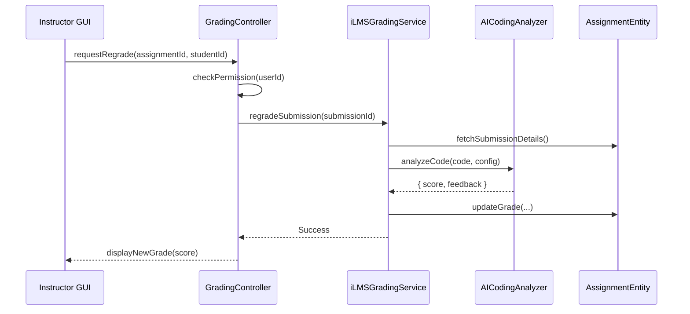
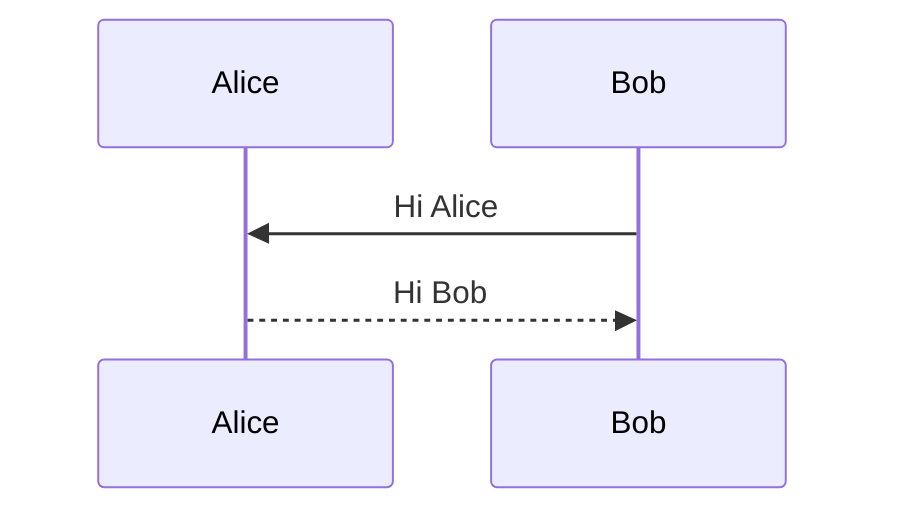
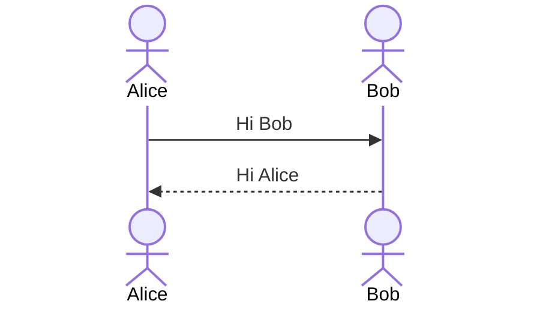
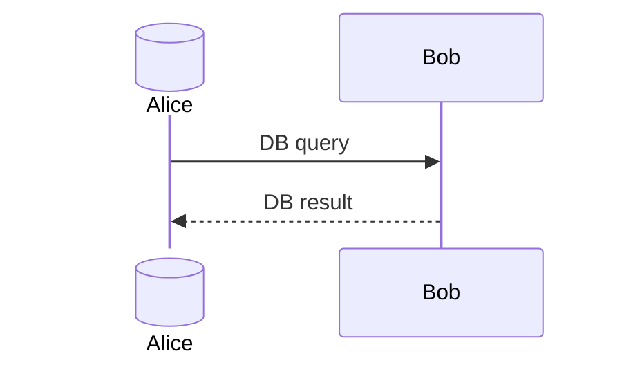
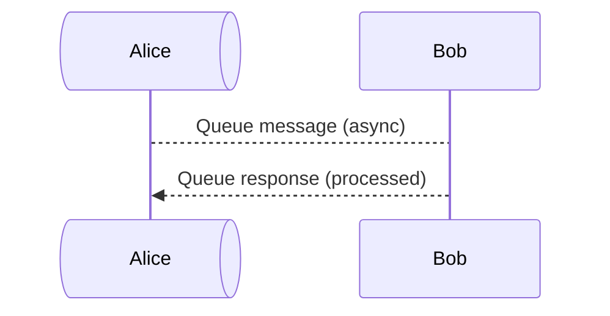
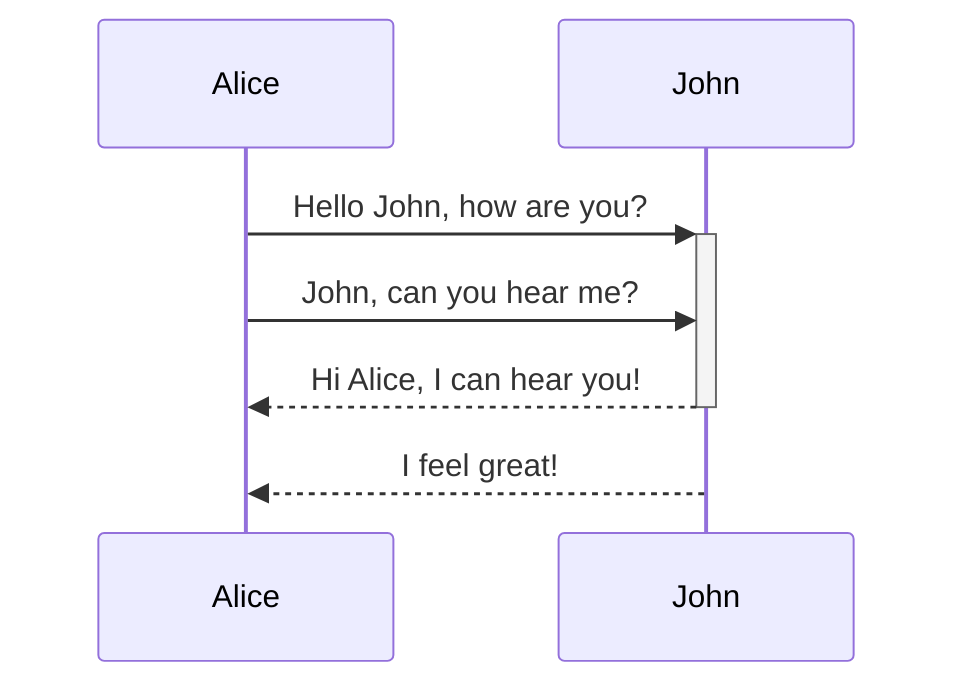
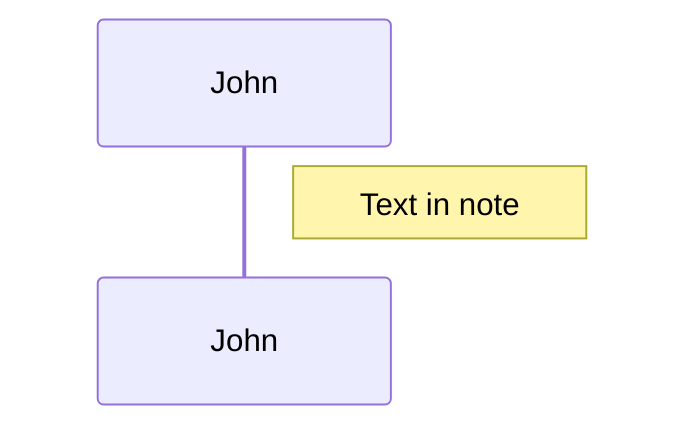
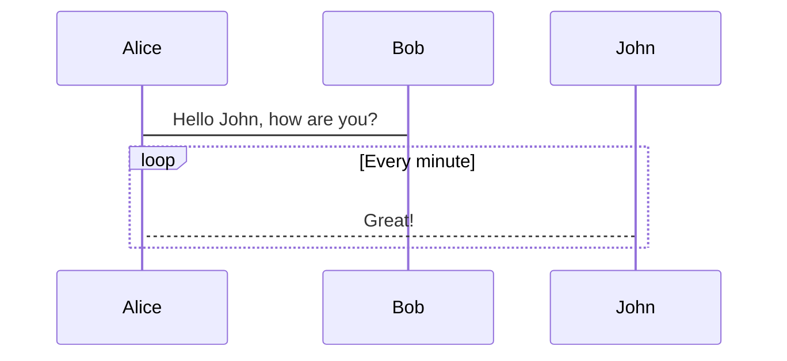
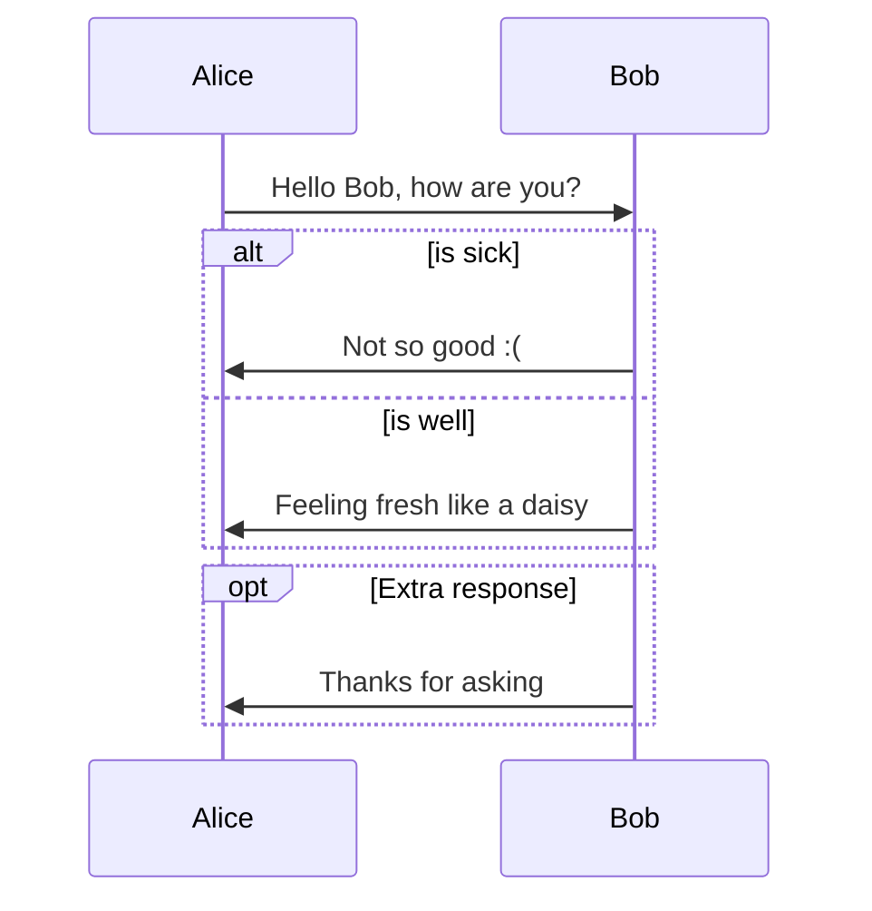
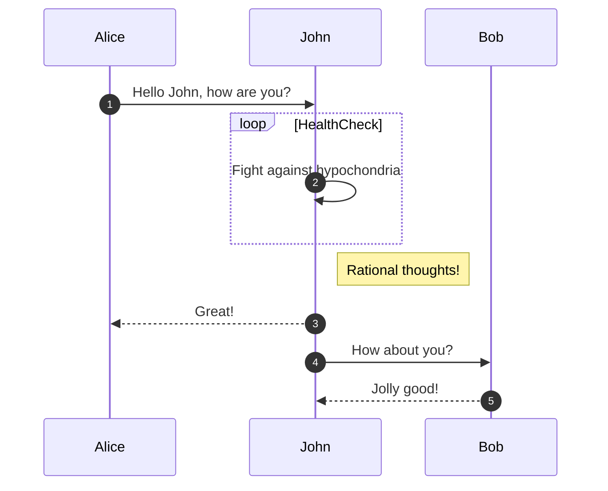

Template này được thiết kế để bạn có thể sao chép và điền thông tin, đảm bảo mỗi SD là một tài liệu thiết kế có cấu trúc và tính liên kết cao (traceability).

---

# Template Đặc Tả SEQUENCE DIAGRAM (SD)

## I. Thông Tin Tổng Quan (Header Information)

| Trường (Field) | Nội dung | Ghi chú/Ví dụ |
| :--- | :--- | :--- |
| **SD ID** | Mã định danh duy nhất của Sequence Diagram. | **SD-UCI-05-1** (Tương ứng với Luồng chính của UC: UCI-05-1) |
| **Related UC ID** | ID của Use Case mà SD này đang chi tiết hóa. | **UCI-05-1** |
| **SD Name** | Tên mô tả luồng tương tác này. | **Luồng Chấm điểm tự động và Phản hồi AI** |
| **Description** | Mô tả tóm tắt mục đích của SD. | Mô tả cách thức Giảng viên gửi yêu cầu chấm điểm và cách hệ thống điều phối giữa các module (Control, AI, Entity) để xử lý. |
| **Primary Actor** | Tác nhân chính khởi tạo luồng. | Giảng viên (Instructor) |
| **Phiên bản (Version)** | 0.1.0 | Tăng khi có thay đổi đáng kể |
| **Trạng thái (Status)** | Draft | Draft/Review/Approved |
| **Tác giả (Author)** | Tên người biên soạn | Team/Role |
| **Ngày (Date)** | YYYY-MM-DD | Ngày cập nhật gần nhất |
| **Liên kết UC/BR/NFR** | Link tới UC/Business Rules/NFR | Dán permalink |
| **Nguồn biểu đồ (Diagram Source)** | Mermaid/PlantUML | Lưu tại repo và link kèm |
| **Tài liệu liên quan (Related Artifacts)** | Liệt kê file liên quan | usecases/*.md, ADR, API Spec |

---

## II. Danh Sách Đối Tượng Tham Gia (Participants / Lifelines)

Liệt kê tất cả các thành phần/đối tượng xuất hiện trong biểu đồ, phân loại theo **Stereotype** (thường là Boundary/Control/Entity).

| ID | Tên Đối tượng (Lifeline) | Vai trò/Loại (Stereotype) | Chủ quản (Ownership) | Giao thức/Interface (Protocol) | Phiên bản API | Mô tả chi tiết |
| :--- | :--- | :--- | :--- | :--- | :--- | :--- |
| **L1** | Instructor GUI | Boundary | iLMS Web | HTTP | n/a | Giao diện hiển thị/nhận dữ liệu từ Giảng viên. |
| **L2** | GradingController | Control | iLMS Core | Internal | n/a | Lớp điều khiển nhận yêu cầu từ L1, xử lý xác thực/kiểm tra quyền. |
| **L3** | iLMSGradingService | Service | iLMS Core | Internal | v1 | Lớp nghiệp vụ chính, chứa logic phức tạp, điều phối luồng xử lý. |
| **L4** | AICodingAnalyzer | External Service | AI Platform | gRPC | v2 | Dịch vụ AI bên ngoài, xử lý phân tích và chấm điểm code (Module **UCAI**). |
| **L5** | AssignmentEntity | Entity/DAO | Data Platform | SQL | n/a | Lớp truy cập và lưu trữ dữ liệu Assignment/Grade trong Database. |

---

## III. Biểu Đồ Sequence Diagram (Visual Model)

**(Chèn hình ảnh Biểu đồ Sequence Diagram tại đây)**

*Lưu ý: Biểu đồ phải thể hiện rõ các đối tượng (Lifelines), các Thông điệp (Messages) theo thứ tự thời gian, và các Khung bao (Combined Fragments) cho logic rẽ nhánh.*

---

## IV. Đặc Tả Chi Tiết Luồng Tương Tác (Interaction Flow Specification)

### A. Luồng Thành công Chính (Basic Success Flow)

Luồng này phải tương ứng với **Basic Flow** trong Use Case.

| STT | Hành động | Thông điệp (Message) | Sync/Async | Định nghĩa Input | Định nghĩa Output | Nguồn (Source) | Đích (Target) | Lỗi/Timeout | Giao dịch (Txn) |
| :--- | :--- | :--- | :--- | :--- | :--- | :--- | :--- | :--- | :--- |
| **1** | Giảng viên kích hoạt chức năng chấm điểm lại. | `requestRegrade(assignmentId, studentId)` | Sync | `{ assignmentId: string, studentId: string }` | `202 Accepted` | L1: Instructor GUI | L2: GradingController | 400/401 | N/A |
| **2** | Controller kiểm tra quyền truy cập của Giảng viên. | `checkPermission(userId)` | Sync | `{ userId: string }` | `{ allowed: boolean }` | L2: GradingController | L2 (self) | 403 | N/A |
| **3** | Ủy quyền xử lý nghiệp vụ cho Service. | `regradeSubmission(submissionId)` | Async | `{ submissionId: string }` | `jobId: string` | L2: GradingController | L3: iLMSGradingService | 5xx/retry | Bắt đầu Txn |
| **4** | Lấy code và config từ DB. | `fetchSubmissionDetails()` | Sync | `{ submissionId: string }` | `{ code: string, config: object }` | L3: iLMSGradingService | L5: AssignmentEntity | 404 | Đọc |
| **5** | Gửi code tới AI để phân tích. | `analyzeCode(code, config)` | Async | `{ code: string, config: object }` | `{ score: number, feedback: object[] }` | L3: iLMSGradingService | L4: AICodingAnalyzer | timeout/retry | Đang mở |
| **6** | Nhận kết quả từ AI. | `return` | Async | N/A | `{ score, feedback }` | L4: AICodingAnalyzer | L3: iLMSGradingService | error code | Đang mở |
| **7** | Cập nhật điểm và phản hồi vào DB. | `updateGrade(submissionId, score, feedback)` | Sync | `{ submissionId, score, feedback }` | `OK` | L3: iLMSGradingService | L5: AssignmentEntity | 409 | Commit Txn |
| **8** | Trả kết quả thành công về Controller. | `return` | Sync | N/A | `Success` | L3: iLMSGradingService | L2: GradingController | - | Kết thúc Txn |
| **9** | Thông báo thành công cho giao diện. | `displayNewGrade(score)` | Sync | `{ score: number }` | UI updated | L2: GradingController | L1: Instructor GUI | - | N/A |

### B. Luồng Thay thế / Ngoại lệ (Alternative / Exception Flows)

Mô tả chi tiết các logic rẽ nhánh (dùng **Combined Fragments** như `[alt]`, `[opt]`, `[loop]`).

| Fragment ID | Loại | Guard Condition | Ảnh hưởng bước | Error Code/Type | Chiến lược khôi phục | Thông điệp hiển thị | Telemetry (log/metric/trace) |
| :--- | :--- | :--- | :--- | :--- | :--- | :--- | :--- |
| **AF-1** | `[alt]` | `[ nếu L4 trả về plagiarism=true ]` | Thay thế 6-9 | `PLAGIARISM_DETECTED` | Ghi điểm 0, flag plagiarism | "Phát hiện đạo văn" | log: warn; metric: plagiarism_count+1; trace tag: plagiarism=true |
| **AF-2** | `[loop]` | `[ timeout khi gọi L4 (tối đa 3 lần) ]` | Áp dụng 5-6 | `UPSTREAM_TIMEOUT` | Retry 3 lần, exponential backoff | "Hệ thống bận, đang thử lại" | log: error on final; metric: ai_retry; trace event: retry |
| **EF-1** | `[alt]` | `[ kiểm tra quyền thất bại ]` | Thay thế 3-9 | `PERMISSION_DENIED` | Dừng luồng | "Bạn không có quyền thực hiện" | log: warn; metric: auth_denied; trace attr: role |

---

## V. Ghi Chú và Ràng Buộc (Additional Information)

Phần này dùng để bổ sung các chi tiết không thể hiện rõ trên biểu đồ nhưng quan trọng cho việc phát triển và kiểm thử.

| Trường (Field) | Chi tiết |
| :--- | :--- |
| **Timing Constraint** | Liên kết NFR Performance: Tổng latency p95 ≤ 4s cho hop L3↔L4. |
| **Reliability** | Retry policy: maxAttempts=3, backoff=200ms*2^n; Circuit breaker: open 30s. |
| **Idempotency** | Idempotency-Key: `submissionId`; các thao tác cập nhật là idempotent. |
| **Security** | AuthZ: chỉ Giảng viên Primary; Scope: `grading:regrade`; Audit log sự kiện quan trọng. |
| **Data Privacy** | Không log PII; masking `studentId` khi ghi log; TTL retention 30 ngày cho trace. |
| **Observability** | Metrics: `ai_latency_ms`, `ai_error_rate`, `plagiarism_count`; Trace: span `AICodingAnalyzer.call`. |
| **Business Rules** | Liên kết Rule: chỉ Giảng viên Primary được chấm lại; ghi nhận nguồn điểm là AI. |
| **Technical Notes** | Giao tiếp L3↔L4 qua gRPC; schema phản hồi AI ở mục VIII. |
| **Post-Conditions** | Điểm mới cập nhật, gắn nhãn `AI-Generated`; thông báo thành công tới Giảng viên. |

---

## VI. Tác Động Dữ Liệu (Data Impact)

| Entity/Bảng | Hành động | Trường bị ảnh hưởng | Ràng buộc/Quy tắc |
| :--- | :--- | :--- | :--- |
| `AssignmentGrade` | UPDATE | `score`, `feedback`, `source` | `source ∈ {Manual, AI-Generated}` |
| `PlagiarismFlag` | UPSERT | `submissionId`, `flag`, `similarity` | Upsert theo `submissionId` |

---

## VII. Giả Định & Câu Hỏi Mở (Assumptions & Open Questions)

- Giả định: AICodingAnalyzer ổn định, trả về trong ≤ 3s ở p95.
- Giả định: `regradeSubmission` chạy nền, không block UI.
- Câu hỏi mở: Có cần hiển thị chi tiết feedback theo từng dòng hay tổng hợp?
- Câu hỏi mở: Chính sách ghi đè điểm thủ công bởi AI?

---

## VIII. Nguồn Biểu Đồ (Diagram Source) & Ví dụ Phản Hồi AI

### A. Mermaid (tùy chọn)


#### Chú giải (Legend) cho Mermaid Sequence

- Ấn định vai trò:
  - `participant`/`actor`: định nghĩa lifeline. Dùng alias `as` để dễ đọc.
  - `participant X@{"type":"database"}`: vẽ biểu tượng Database; `type` có thể là `database`, `queue`.
  - `Note left/right of <name>`: chú thích cạnh lifeline.
- Kiểu mũi tên và ý nghĩa:
  - `->` Sync message (không có block UI khuyến nghị dùng `->>` cho call có response rõ).
  - `->>` Call đồng bộ (sync) kèm nhấn mạnh request-response.
  - `-->>` Response/return từ callee về caller.
  - `-->` Message bất đồng bộ (async) hoặc signal/event.
  - `->>+` Activate: bắt đầu activation bar của callee; `-->>-` Deactivate: kết thúc.
- Khối điều khiển (Combined Fragments):
  - `alt/else/end`: rẽ nhánh điều kiện.
  - `opt/end`: nhánh tùy chọn.
  - `loop <label>/end`: vòng lặp, có thể ghi điều kiện.
  - `autonumber`: tự động đánh số bước.

#### Ví dụ nâng cao (Advanced examples)



















### B. JSON Schema phản hồi AI (ví dụ)
```json
{
  "score": 87,
  "feedback": [
    { "line": 12, "type": "style", "message": "Use const instead of let" },
    { "line": 45, "type": "bug-risk", "message": "Unhandled promise rejection" }
  ],
  "plagiarism": { "flag": false, "similarity": 0.12 },
  "modelVersion": "AICodingAnalyzer-2.1",
  "processingMs": 1320,
  "traceId": "af1c-..."
}
```